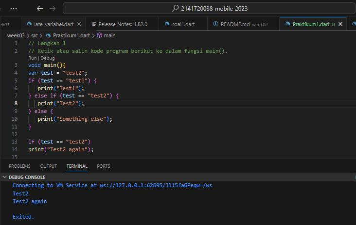
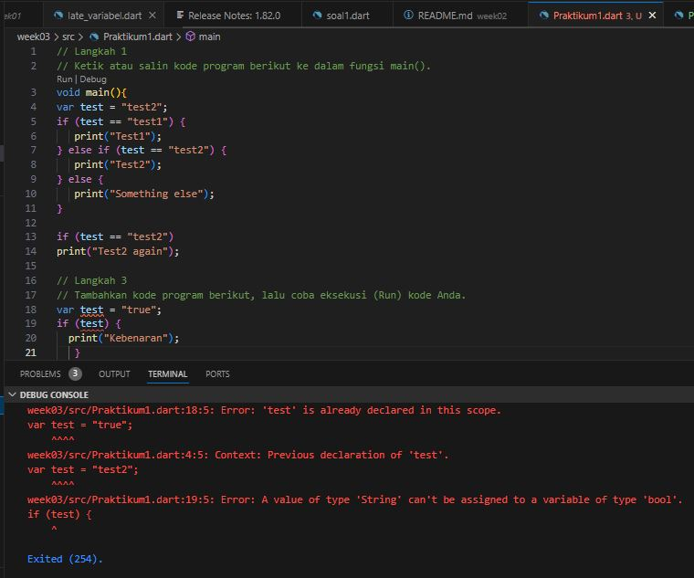
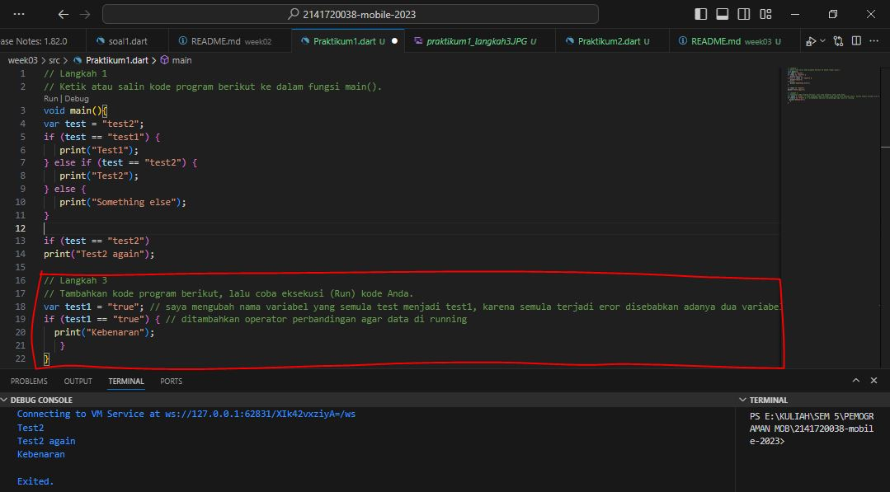
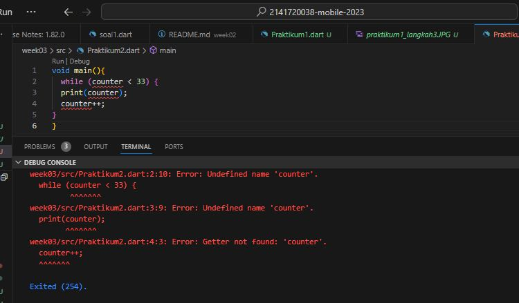
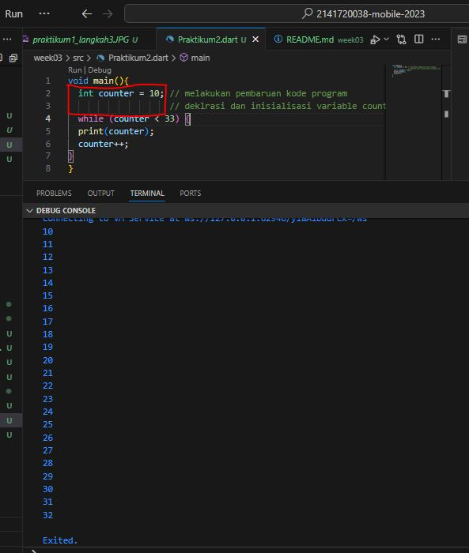
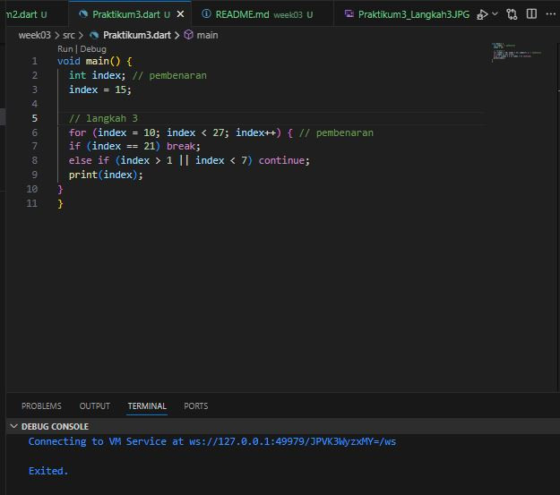
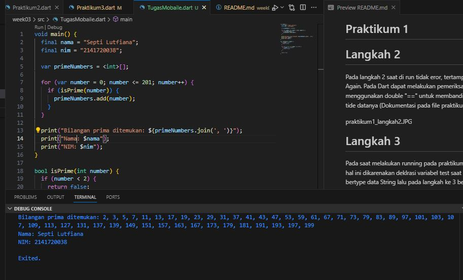

+----+---------------------------------------+

SEPTI LUTFIANA 
| 2141720038                                 |

+----+----------------------------------------+
# Praktikum 1 
# Langkah 2

Pada langkah 2 saat di run tidak eror, tertampil nilai Test2 dan Test2 Again. Pada Dart dapat melakukan pemeriksaan dua variable dengan menggunakan double "==" untuk membandingkan nilai sekaligus tide datanya
(Dokumentasi pada file praktikum1_langkah2.JPG)

# Langkah 3

Pada saat melakukan running pada praktikum 1 langkah 3, terjadi eror hal ini dikarenakan deklrasi variabel test saat kode sebelumnya bertype data String lalu pada langkah ke 3 bertype var, hal inilah yang menyebabkan eror dikarenakan pemanggilan type data yang berbeda pada satu nama variable yang sama.

* Pembenaran Kode Program pada langkah 3

- var test1 = "true"; 

- if (test1 == "true") { 

- print("Kebenaran");

   }

Setelah dilakukan perubahan pada kode program, pada saat di running muncul hasil

Test2

Test2 again

Kebenaran

# Praktikum 2
# Langkah 2

pada langkah ke 2 ini, saat kode di eksekusi muncul eror, hal ini dikarenakan varibale dengan nama "counter" belum di deklarasi dan diinisialisasi pada fungsi main ini, sehingga saat di running nama variable "counter" tidak bisa di baca dan menyebabkan eror. Agar bisa di running maka perlu di ubah pada kode programnya seperti ini

 
 - void main(){
  
  int counter = 10; // melakukan pembaruan kode program  deklrasi dan inisialisasi variable 
                    
counter
  
  while (counter < 33) {
  
  print(counter);
  
  counter++;

}

}

- Hasilnya
terprint data dari angka 10 - 33

# Praktikum 3

# Langkah 2

pada langkah ke 2 ini, saat kode di eksekusi muncul eror, hal ini dikarenakan varibale dengan nama "Index" belum di deklarasi dan diinisialisasi pada fungsi main ini, sehingga saat di running nama variable "Index" tidak bisa di baca dan menyebabkan eror. 

Selain itu juga terdapat perbedaan pemanggilan variabel yang digunakan untuk perulangan for yang menyebabkan eror dan juga ekspresen pada variable indek tidak dijalankan increment ataupun ekskrement. Agar bisa di running maka perlu di ubah pada kode programnya seperti berikut,

- Kode Program

void main() {

  int index;

  index = 10;

  for (index = 10; index < 27; index++) {

  print(index);

}

}

- Hasil Run

setelah di lakukan pembenaran pada kode program langkah 2, saat dilakukan running akan tercetak angka dari angka 10 - 26, kenapa angka 27 tidak karena batas nilainya kurang dari nilai 27.

# Langkah 3
Pada Langkah 3 ini saat di running muncul eror dikarenakan saat menuliskan atau mendeklarasikan variabel atau function pada kode program berbeda sehingga compailer saat melakukan running bingung atau tidak bisa membacanya.

## TUGAS PRAKTIKUM 

Dalam kode tersebut, menggunakan list primeNumbers untuk menyimpan bilangan prima yang ditemukan. Setelah selesai mencari bilangan prima, dilanjutkan menggunakan metode join untuk menggabungkan elemen-elemen dalam list menjadi satu string yang dipisahkan oleh koma dan spasi. Kemudian, kita mencetak string tersebut dalam satu baris menggunakan print.