# Nama Septi Lutfiana
# NIM 2141720038

# PRAKTIKUM 1
### LANGKAH 1
Ketik atau salin kode program berikut ke dalam void main().

''''dart
void main(){
  var list = [1, 2, 3];
  assert(list.length == 3);
  assert(list[1] == 2);
  print(list.length);
  print(list[1]);
  list[1] = 1;
  assert(list[1] == 1);
  print(list[1]);
}
'''
### LANGKAH 2
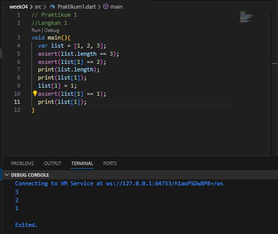

- penjelasan 
saat kode program di run, muncul hasil 3,2,1. Mengapa seperti itu, karena kode program pertama memanggil untuk mencetak panjang list, yaitu == 3. pengecekan untuk memastikan apakah nilainya itu 3 menggunakan kode assert (untuk memastikan nilai itu benar) lalu perintah print kedua melakukan print list pada index ke 1, akan tetapi nilai list pada index ke 1 diganti nilainya menjadi 2.  Lalu pada perintah print ke 3 itu sama seperti halnya pada perintah ke dua, akan tetapi nilai valuenya dapat dirubah menjadi 1, hal ini dikarenakan dilakukan deklrasi baru atau mengubah isi value pada index ke 1 menjadi 1. sehingga hasilnya seperti pada gambar diatas.
### LANGKAH 3
Ubah kode pada langkah 1 menjadi variabel final yang mempunyai index = 5 dengan default value = null. Isilah nama dan NIM Anda pada elemen index ke-1 dan ke-2. Lalu print dan capture hasilnya.

Apa yang terjadi ? Jika terjadi error, silakan perbaiki.

* Jawab
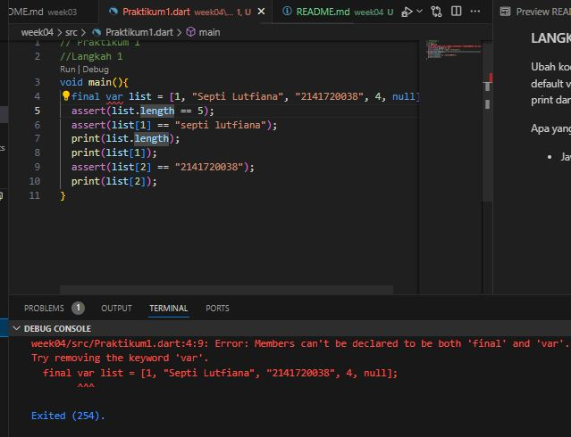
- penjelasan
Pada percobaan ini saat di running terjadi eror, karena tidak dapat mendeklarasikan type final dan var, karena kata kunci var dan final pada deklarasi variabel list bertentangan satu sama lain. Kata kunci var digunakan untuk menentukan bahwa jenis variabel akan ditentukan secara otomatis berdasarkan nilai yang diberikan, sedangkan final digunakan untuk mendeklarasikan variabel yang hanya dapat diinisialisasi sekali dan nilainya tidak dapat diubah. 
- pembenahan kode program

Agar kode program dapat dijalankan perlu dihabus kata kunci var menjadi List dynamic.
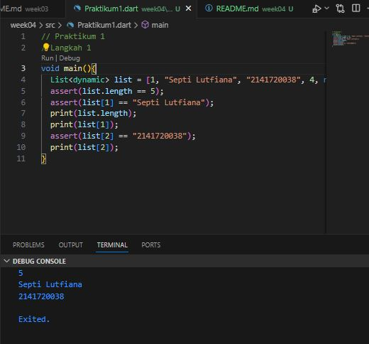

# PRAKTIKUM 2
### LANGKAH 1
Ketik atau salin kode program berikut ke dalam fungsi main().

### LANGKAH 2
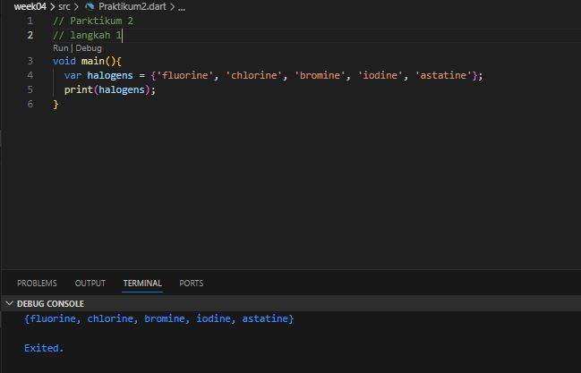

* penjelasan
Saat mencetak halogens akan tercetak hasil daftar nama pada halogens

### Langkah 3

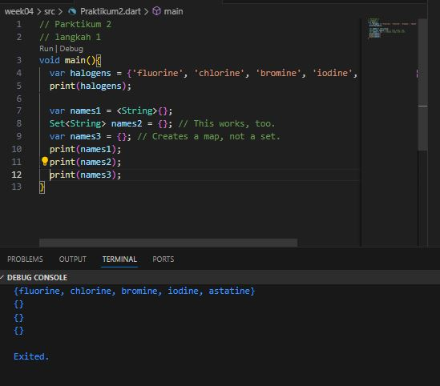

Apa yang terjadi ? Jika terjadi error, silakan perbaiki namun tetap menggunakan ketiga variabel tersebut. Tambahkan elemen nama dan NIM Anda pada kedua variabel Set tersebut dengan dua fungsi berbeda yaitu .add() dan .addAll(). Untuk variabel Map dihapus, nanti kita coba di praktikum selanjutnya.
- Penjelasan

Tidak terjadi eror, akan tetapi saat melakukan cetak names1, names2, names3 kosong, hal ini dikarenakan tidak ada nilai didalam variabel tersebut.

pada kode program ini

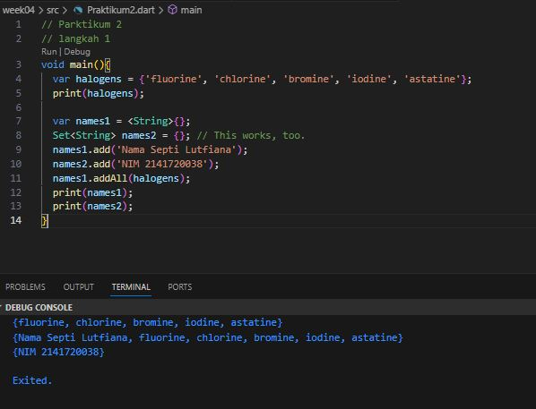

- Penjelasan
Menambahkan Nama dan nim, saat print halogens tercetak daftar nama halogens, sedangkan saat perintah names1.addAll(halogens) tercetak pula nama Septi Lutfiana dan isi dari data halogens, hal ini karena names1 melakukan penambahan isi data. 

## PRAKTIKUM 3
### Langkah 1

Ketik atau salin kode program berikut ke dalam fungsi main().
### Langkah 2

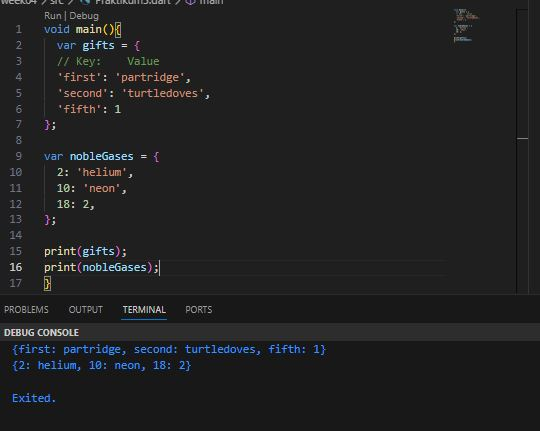

- penjelasan 

model maps terdiri dari dua yaitu key dan value. saat kita melakukan print gifts akan menghasilkan output seperti gambar. lalu nobleGases juga sama.

### Langkah 3
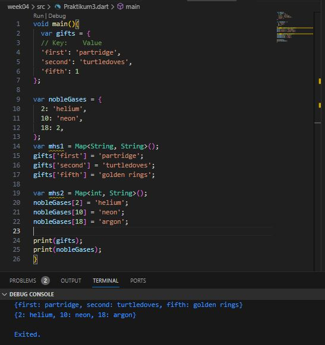

- penjelasan

tidak ada eror, dari kode diatas dapat disimpulkan bahwa nilai atau values dalam maps dapat diganti berdasarkan key (kuncinya)

### penambahan nama dan nim
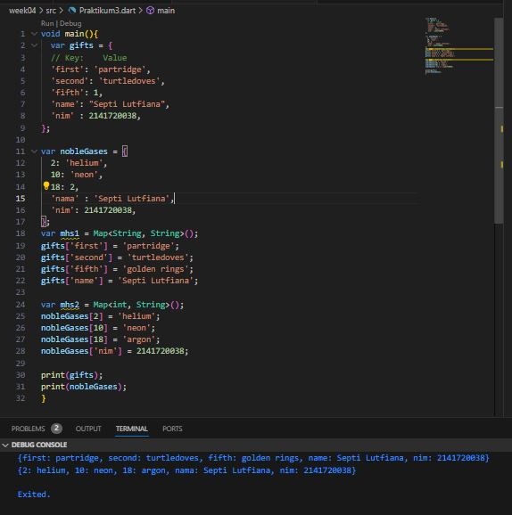

## PRAKTIKUM 4
### LANGKAH 1
### LANGKAH 2
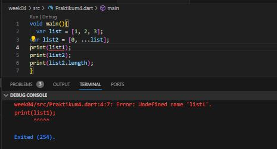

- penjelasan
variable list11 tidak didefinisikan, seharusnya list saja
- pembenaran eror

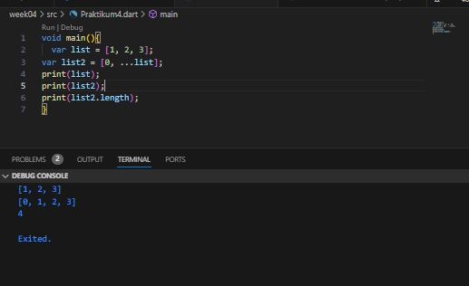

- penjelasan

variabel list1 diuabah menjadi list, karena deklrasi awal list. apabila list1 akan eror seperti percobaan sebelumnya.
### LANGKAH 3
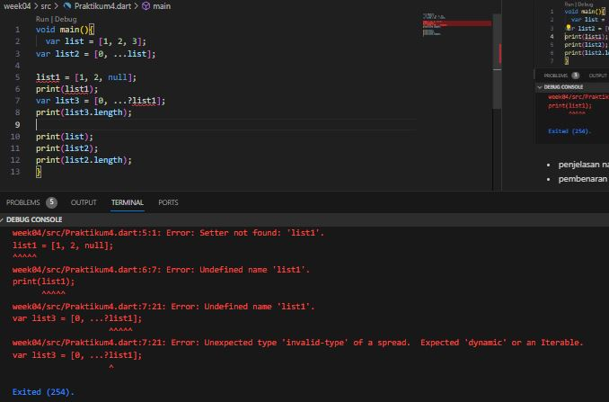
- penjelasan

eror terjadi kerna tidak ada type data pada vriable list1, sehingga saat akan di running mengalama eror, lalu karena list ini memiliki nilai int yang pasti dan bilangan bulat, maka tidak perlu menggunakan tanda ? atau safety null.

- pembenahan kode program
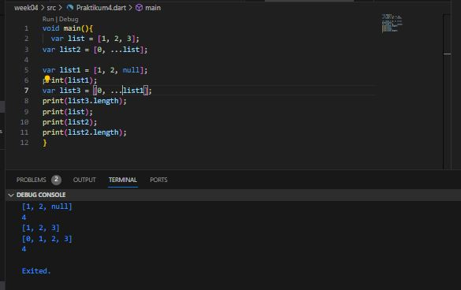

- penjelasan
tidak terjadi eror

# Tambahkan variabel list berisi NIM Anda menggunakan Spread Operators. Dokumentasikan hasilnya dan buat laporannya!

- penjelasan

terjadi notifikasi eror karena menggunakan Spread Operators, untuk memperbaiki diperlukan menghapus Spread Operators.

### LANGKAH 4

Tambahkan kode program berikut, lalu coba eksekusi (Run) kode Anda.

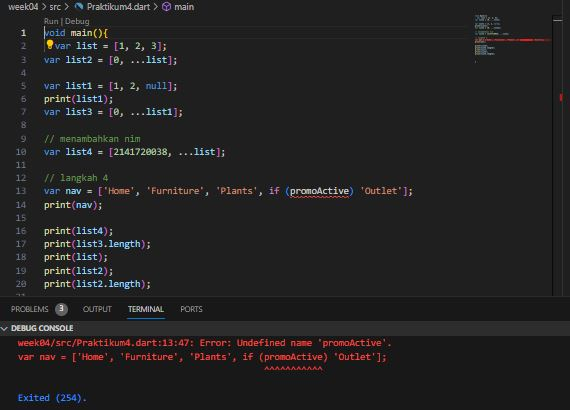

- penjelasan
Kesalahan karena variabel promoActive belum didefinisikan sebelum digunakan dalam ekspresi if di dalam daftar nav.

Sebelum menggunakan promoActive, telah mendefinisikan dan memberikan nilainya. Jikaingin menggunakan variabel promoActive sebagai penentu dalam ekspresi if, pastikan telah mendeklarasikan dan menginisialisasinya sebelum digunakan.

## variabel promoActive ketika true
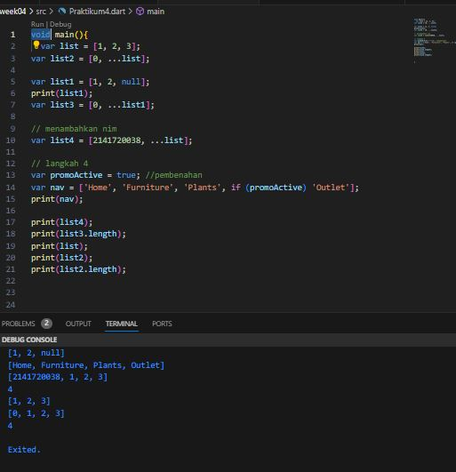

## variabel promoActive ketika false
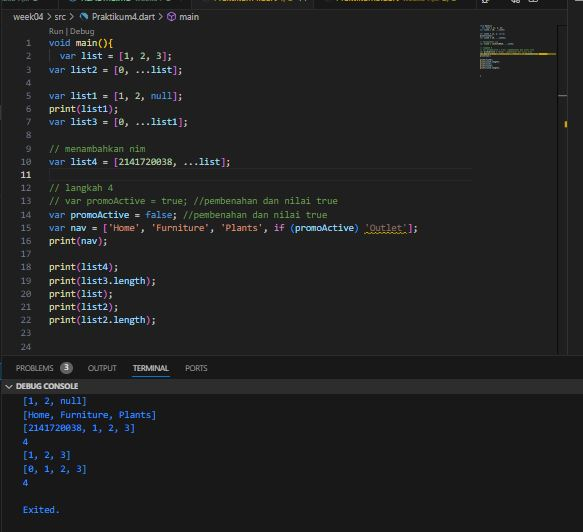

- penjelasan

Ketika nilai promoActive adalah false, mengindikasikan bahwa promo tersebut tidak aktif atau sedang tidak berlaku, sehingga saat dicetak nilai outlet tidak tercetak

### Langkah 5

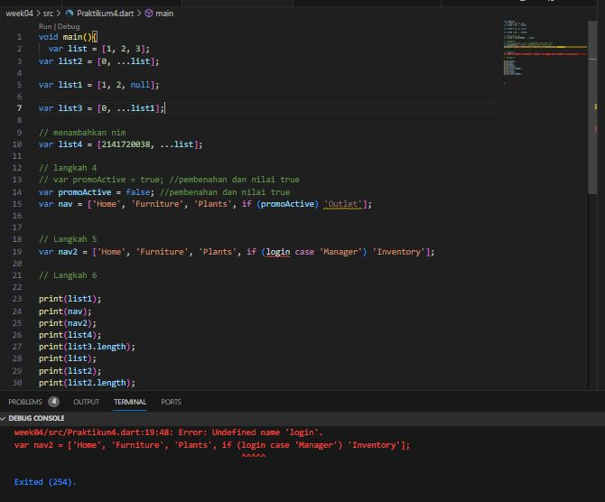

- Penjelasan

Terjadi eror, karena belum melakukan inisialisasi kelas login

## pembenahan eror
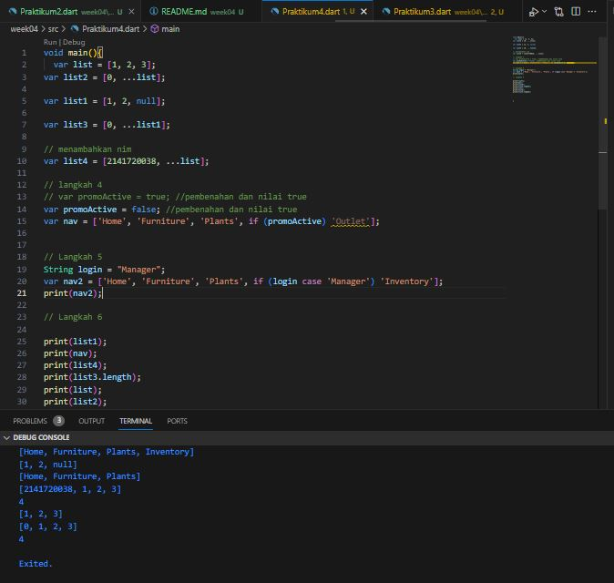

- dilakukan inisialisasi variable login
## Langkah 6

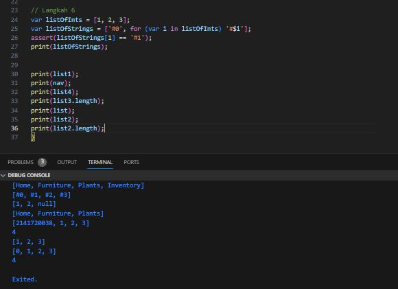

Collection for (atau sering disebut foreach) adalah salah satu konsep dalam pemrograman yang memungkinkan untuk melakukan iterasi atau melintasi elemen-elemen dalam suatu koleksi data (seperti array, list, set, map, dll.) dengan cara yang lebih efisien dan mudah dibaca