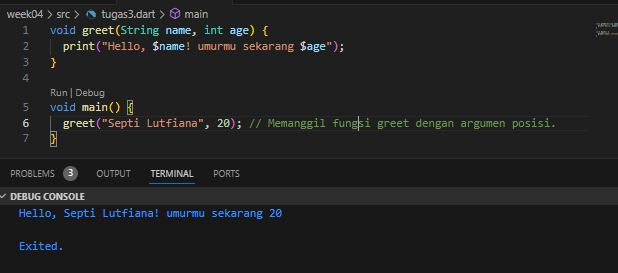

# Nama Septi Lutfiana
# NIM 2141720038

# 1. PENJELASAN LAPORAN PRAKLTIKUM
# PRAKTIKUM 1
### LANGKAH 1
Ketik atau salin kode program berikut ke dalam void main().

''''dart
void main(){
  var list = [1, 2, 3];
  assert(list.length == 3);
  assert(list[1] == 2);
  print(list.length);
  print(list[1]);
  list[1] = 1;
  assert(list[1] == 1);
  print(list[1]);
}
'''
### LANGKAH 2

- penjelasan 
saat kode program di run, muncul hasil 3,2,1. Mengapa seperti itu, karena kode program pertama memanggil untuk mencetak panjang list, yaitu == 3. pengecekan untuk memastikan apakah nilainya itu 3 menggunakan kode assert (untuk memastikan nilai itu benar) lalu perintah print kedua melakukan print list pada index ke 1, akan tetapi nilai list pada index ke 1 diganti nilainya menjadi 2.  Lalu pada perintah print ke 3 itu sama seperti halnya pada perintah ke dua, akan tetapi nilai valuenya dapat dirubah menjadi 1, hal ini dikarenakan dilakukan deklrasi baru atau mengubah isi value pada index ke 1 menjadi 1. sehingga hasilnya seperti pada gambar diatas.
### LANGKAH 3
Ubah kode pada langkah 1 menjadi variabel final yang mempunyai index = 5 dengan default value = null. Isilah nama dan NIM Anda pada elemen index ke-1 dan ke-2. Lalu print dan capture hasilnya.

Apa yang terjadi ? Jika terjadi error, silakan perbaiki.

* Jawab

- penjelasan
Pada percobaan ini saat di running terjadi eror, karena tidak dapat mendeklarasikan type final dan var, karena kata kunci var dan final pada deklarasi variabel list bertentangan satu sama lain. Kata kunci var digunakan untuk menentukan bahwa jenis variabel akan ditentukan secara otomatis berdasarkan nilai yang diberikan, sedangkan final digunakan untuk mendeklarasikan variabel yang hanya dapat diinisialisasi sekali dan nilainya tidak dapat diubah. 
- pembenahan kode program

Agar kode program dapat dijalankan perlu dihabus kata kunci var menjadi List dynamic.

# PRAKTIKUM 2
### LANGKAH 1
Ketik atau salin kode program berikut ke dalam fungsi main().

### LANGKAH 2

* penjelasan
Saat mencetak halogens akan tercetak hasil daftar nama pada halogens

### Langkah 3

Apa yang terjadi ? Jika terjadi error, silakan perbaiki namun tetap menggunakan ketiga variabel tersebut. Tambahkan elemen nama dan NIM Anda pada kedua variabel Set tersebut dengan dua fungsi berbeda yaitu .add() dan .addAll(). Untuk variabel Map dihapus, nanti kita coba di praktikum selanjutnya.
- Penjelasan

Tidak terjadi eror, akan tetapi saat melakukan cetak names1, names2, names3 kosong, hal ini dikarenakan tidak ada nilai didalam variabel tersebut.

pada kode program ini

- Penjelasan
Menambahkan Nama dan nim, saat print halogens tercetak daftar nama halogens, sedangkan saat perintah names1.addAll(halogens) tercetak pula nama Septi Lutfiana dan isi dari data halogens, hal ini karena names1 melakukan penambahan isi data. 

## PRAKTIKUM 3
### Langkah 1

Ketik atau salin kode program berikut ke dalam fungsi main().
### Langkah 2

- penjelasan 

model maps terdiri dari dua yaitu key dan value. saat kita melakukan print gifts akan menghasilkan output seperti gambar. lalu nobleGases juga sama.

### Langkah 3

- penjelasan

tidak ada eror, dari kode diatas dapat disimpulkan bahwa nilai atau values dalam maps dapat diganti berdasarkan key (kuncinya)

### penambahan nama dan nim

## PRAKTIKUM 4
### LANGKAH 1
### LANGKAH 2

- penjelasan
variable list11 tidak didefinisikan, seharusnya list saja
- pembenaran eror

- penjelasan

variabel list1 diuabah menjadi list, karena deklrasi awal list. apabila list1 akan eror seperti percobaan sebelumnya.
### LANGKAH 3

- penjelasan

eror terjadi kerna tidak ada type data pada vriable list1, sehingga saat akan di running mengalama eror, lalu karena list ini memiliki nilai int yang pasti dan bilangan bulat, maka tidak perlu menggunakan tanda ? atau safety null.

- pembenahan kode program

- penjelasan
tidak terjadi eror

# Tambahkan variabel list berisi NIM Anda menggunakan Spread Operators. Dokumentasikan hasilnya dan buat laporannya!

- penjelasan

terjadi notifikasi eror karena menggunakan Spread Operators, untuk memperbaiki diperlukan menghapus Spread Operators.

### LANGKAH 4

Tambahkan kode program berikut, lalu coba eksekusi (Run) kode Anda.

- penjelasan
Kesalahan karena variabel promoActive belum didefinisikan sebelum digunakan dalam ekspresi if di dalam daftar nav.

Sebelum menggunakan promoActive, telah mendefinisikan dan memberikan nilainya. Jikaingin menggunakan variabel promoActive sebagai penentu dalam ekspresi if, pastikan telah mendeklarasikan dan menginisialisasinya sebelum digunakan.

## variabel promoActive ketika true

## variabel promoActive ketika false

- penjelasan

Ketika nilai promoActive adalah false, mengindikasikan bahwa promo tersebut tidak aktif atau sedang tidak berlaku, sehingga saat dicetak nilai outlet tidak tercetak

### Langkah 5

- Penjelasan

Terjadi eror, karena belum melakukan inisialisasi kelas login

## pembenahan eror

- dilakukan inisialisasi variable login
## Langkah 6

Collection for (atau sering disebut foreach) adalah salah satu konsep dalam pemrograman yang memungkinkan untuk melakukan iterasi atau melintasi elemen-elemen dalam suatu koleksi data (seperti array, list, set, map, dll.) dengan cara yang lebih efisien dan mudah dibaca.

## PRAKTIKUM 5
### LANGKAH 1
### LANGKAH 2

terjadi eror dikarenakan setelah perintah print perlu ditambahkan semi kolon (;).

- pembenahan

- penjelasan
saat kode tersebut dijalankan akan menghasilkan 
output seperti gambar, dimana akan di print nilai first, last a: 2, b: true.

 variabel record berisi campuran elemen string dan pasangan key-value.

 ### LANGKAH 3
 
 hasilnya tidak ada perubahan dari kode sebelumnya pada langkah 2
 - pembenahan

 

 Output pertama mencetak nilai record yang asli, yaitu ('first', a: 2, b: true, 'last'). Output kedua mencetak hasil pertukaran nilai dari pemanggilan fungsi tukar(), yaitu (3, 2).

### Langkah 4

terjadi eror karena variable bersifat non null variable, sehingga saat di akan terjadi eror.

- pembenahan

Menambahkan inisialisasi nilai pada variabel mahasiswa dengan nilai ('Septi Lutfiana, 2141720038) nama dan nim nahasiswa.

### LANGKAH 5

- penjelasan
Output pertama hingga ketiga adalah output yang sama seperti sebelumnya. Output keempat hingga terakhir mencetak nilai-nilai dari variabel mahasiswa2 sesuai dengan pencetakannya:

print(mahasiswa2.$1); mencetak nilai 'first'.
print(mahasiswa2.a); mencetak nilai 2.
print(mahasiswa2.b); mencetak nilai true.
print(mahasiswa2.$2); mencetak nilai 'last'.

- Penambahan NIM dan Nama

terdapat perubahan yaitu penambahan nama dan nim.

# 2. Jelaskan yang dimaksud Functions dalam bahasa Dart!

- Jawab
Dalam bahasa Dart, Functions (fungsi) adalah blok kode yang dapat menerima argumen, melakukan operasi, dan mengembalikan nilai. Fungsi digunakan untuk mengorganisir dan mengelompokkan kode menjadi unit yang dapat digunakan dan dipanggil secara berulang.

# 3. Jelaskan jenis-jenis parameter di Functions beserta contoh sintaksnya!

- jawab
Dalam bahasa Dart, terdapat dua jenis parameter yang dapat digunakan dalam deklarasi fungsi, yaitu parameter posisi (positional parameter) dan parameter bernama (named parameter).

Parameter Posisi (Positional Parameter):

- Parameter posisi adalah parameter yang dideklarasikan berdasarkan urutan posisinya saat memanggil fungsi.
- Argumen yang dikirimkan saat memanggil fungsi akan diteruskan ke parameter posisi sesuai dengan urutan posisinya.
- Parameter posisi bersifat wajib diisi saat memanggil fungsi, kecuali jika ada nilai default yang ditentukan.
- Contoh sintaks:

- Parameter Bernama (Named Parameter):

- Parameter bernama adalah parameter yang dideklarasikan dengan menggunakan sintaks nama_parameter: nilai.
- Ketika memanggil fungsi, argumen dikirimkan dengan menyebutkan nama parameternya, diikuti dengan tanda titik dua (:) dan nilai yang ingin diteruskan.
Penggunaan parameter bernama bersifat opsional dan dapat diabaikan saat memanggil fungsi jika ada nilai default yang ditentukan.

Contoh sintaks:

# 4. Jelaskan maksud Functions sebagai first-class objects beserta contoh sintaknya!

- jawaban

Dalam bahasa pemrograman, konsep "first-class objects" (objek kelas satu) mengacu pada kemampuan untuk memperlakukan fungsi sebagai nilai yang dapat disimpan dalam variabel, dilewatkan sebagai argumen ke fungsi lain, dan dikembalikan sebagai nilai dari fungsi lain. Dalam konteks ini, fungsi diperlakukan seperti objek lainnya dalam bahasa tersebut.

- contoh sintak

# 5. Apa itu Anonymous Functions? Jelaskan dan berikan contohnya!

- jawab
Anonymous functions, juga dikenal sebagai lambda functions atau function literals, adalah fungsi yang tidak memiliki nama.

- KODE

- penjelasan

tanda kurung kurawal {} dan kata kunci => untuk mendefinisikan anonymous function. Fungsi anonim tersebut menggandakan setiap elemen dalam list numbers dan mengembalikan hasilnya. Kemudian, metode toList() untuk mengonversi hasil iterable menjadi list, dan hasilnya dicetak menggunakan print().

# 6. Jelaskan perbedaan Lexical scope dan Lexical closures! Berikan contohnya!

- Jawab
Lexical scope dan lexical closures adalah konsep penting dalam pemrograman yang terkait dengan pengaturan dan akses variabel dalam suatu lingkup.

* Lexical Scope:
Lexical scope (lingkup leksikal) mengacu pada cara variabel diikat (bound) dalam sebuah program berdasarkan tempat atau posisi di dalam kode.

* code

- Lexical closures

Lexical closures (penutup leksikal) adalah kombinasi antara fungsi dan lingkungan leksikal di mana fungsi tersebut didefinisikan. Closures memungkinkan fungsi untuk tetap memiliki akses ke variabel-variabel yang ada di lingkungan leksikal di mana fungsi tersebut didefinisikan, bahkan setelah lingkungan tersebut selesai dieksekusi.

- kode

- kesimpulannya

Jadi, perbedaan utama antara lexical scope dan lexical closures adalah bahwa lexical scope mengatur akses variabel berdasarkan struktur kode, sementara lexical closures memungkinkan fungsi untuk tetap memiliki akses ke variabel-variabel dalam lingkungan leksikal di mana fungsi tersebut didefinisikan, bahkan setelah lingkungan tersebut selesai dieksekusi.

# 7. Jelaskan dengan contoh cara membuat return multiple value di Functions!

- jawab

Menggunakan List atau Array:

mengembalikan sebuah List atau Array yang berisi nilai-nilai yang ingin dikembalikan. Anda dapat menempatkan nilai-nilai tersebut ke dalam sebuah List atau Array, dan kemudian mengembalikan List atau Array tersebut dari fungsi.

