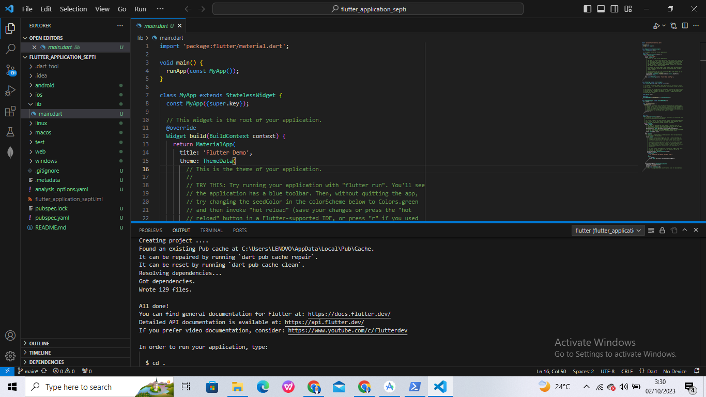
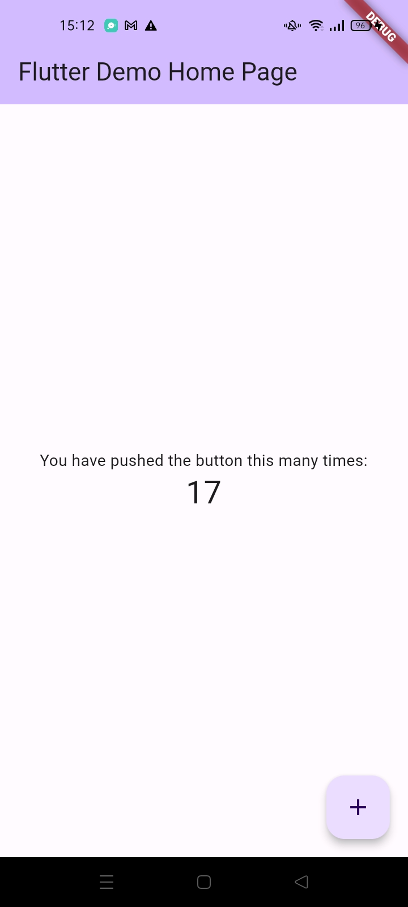
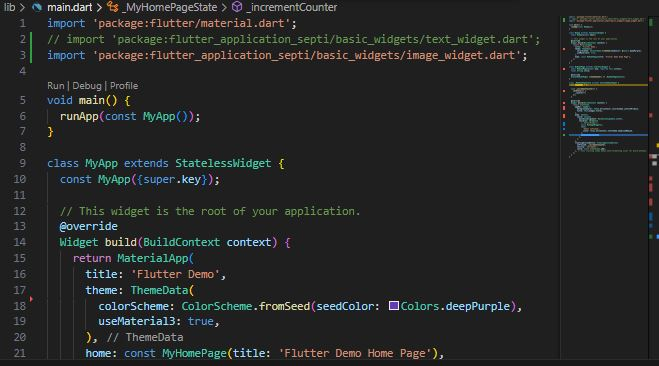
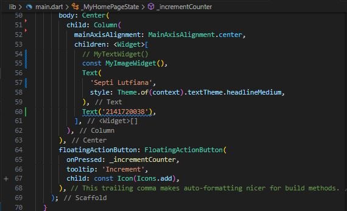
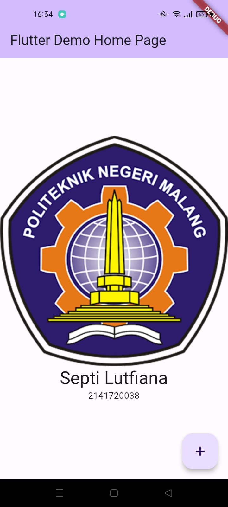
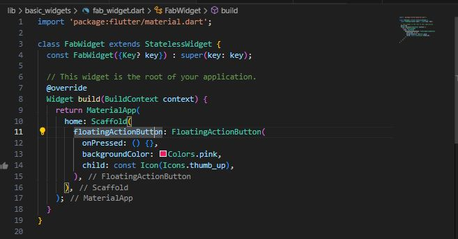
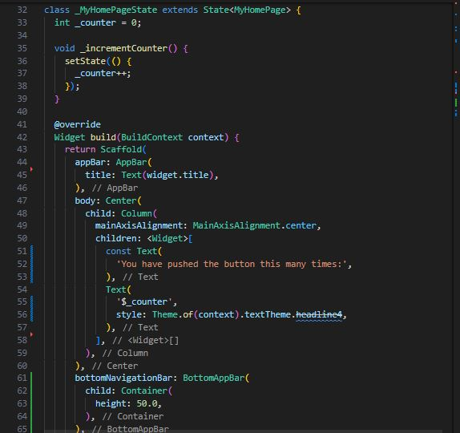
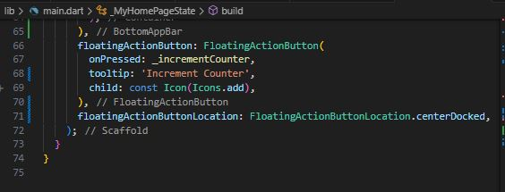

# flutter_application_septi
* Nama Septi Lutfiana
* NIM 2141720038
* Kelas 3H TI

A new Flutter project.

# Praktikum 1 : Membuat Project Flutter Baru
## Langkah 1
Buka VS Code, lalu tekan tombol Ctrl + Shift + P maka akan tampil Command Palette, lalu ketik Flutter. Pilih New Application Project.
## Langkah 2
Kemudian buat folder sesuai style laporan praktikum yang Anda pilih. Disarankan pada folder dokumen atau desktop atau alamat folder lain yang tidak terlalu dalam atau panjang. Lalu pilih Select a folder to create the project ini.
## Langkah 3
Buat nama project flutter hello_world seperti berikut, lalu tekan Enter. Tunggu hingga proses pembuatan project baru selesai.

## Langkah 4
Jika sudah selesai proses pembuatan project baru, pastikan tampilan seperti berikut. Pesan akan tampil berupa "Your Flutter Project is ready!" artinya Anda telah berhasil membuat project Flutter baru

# Praktikum 2 : Membuat Repository GitHub dan Laporan Praktikum

## Langkah 1,2,3,4,5,6,7,8,9,10
saya melewati langkah ini, sesuai intruksi dari dosen pengampu

## Langkah 11
Kembali ke VS Code, ubah platform di pojok kanan bawah ke emulator atau device atau bisa juga menggunakan browser Chrome. Lalu coba running project hello_world dengan tekan F5 atau Run > Start Debugging. Tunggu proses kompilasi hingga selesai, maka aplikasi flutter pertama Anda akan tampil seperti berikut.

#### Kode Program

#### Hasil Running

## LANGKAH 12
Silakan screenshot seperti pada Langkah 11, namun teks yang ditampilkan dalam aplikasi berupa nama lengkap Anda. Simpan file screenshot dengan nama 01.png pada folder images (buat folder baru jika belum ada) di project hello_world Anda. Lalu ubah isi README.md seperti berikut, sehingga tampil hasil screenshot pada file README.md. Kemudian push ke repository Anda.

#### kode program

#### hasil running

# Praktikum 3 : Menerapkan Widget Dasar
### Langkah 1: Text Widget
Buat folder baru basic_widgets di dalam folder lib. Kemudian buat file baru di dalam basic_widgets dengan nama text_widget.dart. Ketik atau salin kode program berikut ke project hello_world Anda pada file text_widget.dart.

#### kode program

#### hasil running

### Langkah 2: Image Widget
Buat sebuah file image_widget.dart di dalam folder basic_widgets dengan isi kode berikut.

#### kode program image_widget.dart

main.dart

hasil

# Praktikum 4 : : Menerapkan Widget Material Design dan iOS Cupertino
## Langkah 1: Cupertino Button dan Loading Bar
Buat file di basic_widgets > loading_cupertino.dart. Import stateless widget dari material dan cupertino. Lalu isi kode di dalam method Widget build adalah sebagai berikut.

#### kode program
## Langkah 2: Floating Action Button (FAB)

Button widget terdapat beberapa macam pada flutter yaitu ButtonBar, DropdownButton, TextButton, FloatingActionButton, IconButton, OutlineButton, PopupMenuButton, dan ElevatedButton.

Buat file di basic_widgets > fab_widget.dart. Import stateless widget dari material. Lalu isi kode di dalam method Widget build adalah sebagai berikut.

## Langkah 3: Scaffold Widget
Dialog widget pada flutter memiliki dua jenis dialog yaitu AlertDialog dan SimpleDialog.

Ubah isi kode main.dart seperti berikut.

#### hasil

## Langkah 4: Dialog Widget

Flutter menyediakan widget yang dapat menerima input dari pengguna aplikasi yaitu antara lain Checkbox, Date and Time Pickers, Radio Button, Slider, Switch, TextField.

Contoh penggunaan TextField widget adalah sebagai berikut:

## Langkah 5: Input dan Selection Widget

Flutter menyediakan widget yang dapat menerima input dari pengguna aplikasi yaitu antara lain Checkbox, Date and Time Pickers, Radio Button, Slider, Switch, TextField.

Contoh penggunaan TextField widget adalah sebagai berikut:

## Langkah 6: Date and Time Pickers
Date and Time Pickers termasuk pada kategori input dan selection widget, berikut adalah contoh penggunaan Date and Time Pickers

