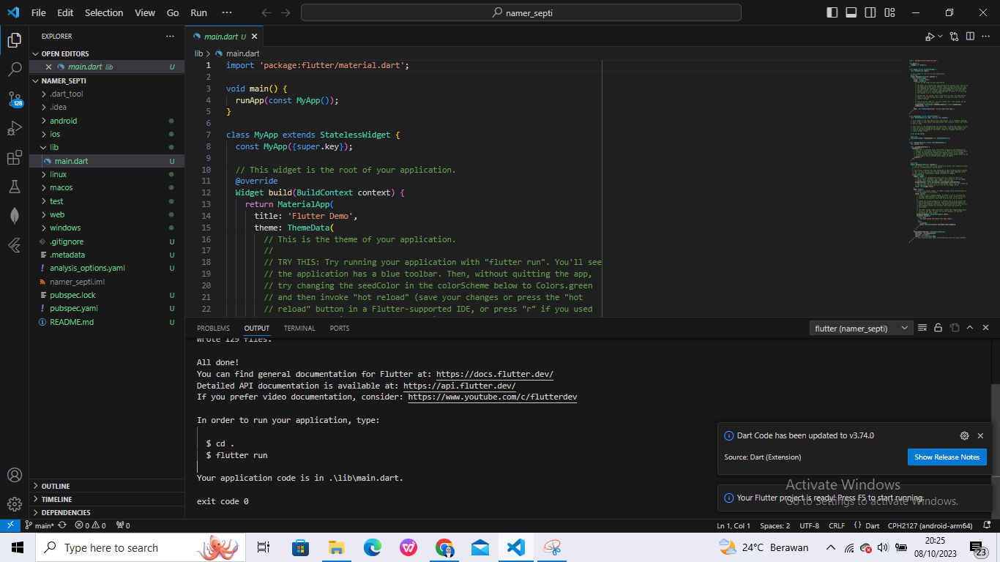

# namer_septi

A new Flutter project.
* Septi Lutfiana
* 2141720038
* 3H TI

## Langkah 1

## Langkah 2

## Langkah 3

## Langkah 4
pubspec.yaml

File pubspec.yaml menentukan informasi dasar tentang aplikasi Anda, seperti versi aplikasi saat ini, dependensi aplikasi, dan aset yang digunakan oleh aplikasi untuk pengiriman.

## Langkah 5
analysis_options.yaml

File ini menentukan seberapa ketat Flutter saat menganalisis kode 

## Langkah 6

analysis_options.yaml

# Menambahkan tombol -step4

## Langkah 1
Di bagian bawah lib/main.dart, tambahkan sesuatu pada string di objek Text pertama, dan simpan file tersebut

kode

hasil

# Memperindah halaman aplikasi -step5

## Mengekstrak widget

