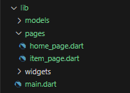

# week08

- Septi Lutfiana - 2141720038

## Praktikum Minggu ke 8 - Navigasi dan Rute
Selesaikan Praktikum Navigasi dan Rute tersebut, lalu dokumentasikan dan push ke repository Anda berupa screenshot setiap hasil pekerjaan beserta penjelasannya di file README.md. Kumpulkan link commit repository GitHub Anda ke spreadsheet yang telah disediakan!
## Langkah 1

## pubspec.yaml
```dart

flutter:
  assets:
    - asset/salt.jpg
    - asset/madu.jpg
    - asset/paperbag.jpg
    - asset/sugar.jpg
    - asset/permen.jpg

```
## Kode Program home_page.dart
```dart
import 'package:flutter/material.dart';
import 'package:week08/models/item.dart';

class HomePage extends StatelessWidget {
  final List<Item> items = [
    Item(
        name: 'Sugar',
        price: 5000,
        gambar: 'asset/sugar.jpg',
        stok: 5,
        rating: 4.5),
    Item(
        name: 'Salt',
        price: 2000,
        gambar: 'asset/salt.jpg',
        stok: 12,
        rating: 4.5),
    Item(
        name: 'Madu',
        price: 25000,
        gambar: 'asset/madu.jpg',
        stok: 13,
        rating: 4.7),
    Item(
        name: 'Paper Bag',
        price: 24000,
        gambar: 'asset/paperbag.jpg',
        stok: 40,
        rating: 4.3),
    Item(
        name: 'Candy',
        price: 16500,
        gambar: 'asset/permen.jpg',
        stok: 230,
        rating: 4.6),
  ];

  @override
  Widget build(BuildContext context) {
    return Scaffold(
      appBar: AppBar(
        title: const Text('Shopping List'),
      ),
      body: GridView.builder(
        gridDelegate: const SliverGridDelegateWithFixedCrossAxisCount(
          crossAxisCount: 2,
          childAspectRatio: 0.7,
        ),
        itemCount: items.length,
        itemBuilder: (context, index) {
          final item = items[index];
          return InkWell(
            onTap: () {
              Navigator.pushNamed(context, '/item', arguments: item);
            },
            child: Card(
              child: Padding(
                padding: const EdgeInsets.all(8),
                child: Column(
                  crossAxisAlignment: CrossAxisAlignment.start,
                  children: [
                    Hero(
                      tag: 'productImage${item.name}',
                      child: AspectRatio(
                        aspectRatio: 1,
                        child: Image.asset(item.gambar, fit: BoxFit.cover),
                      ),
                    ),
                    Row(
                      mainAxisAlignment: MainAxisAlignment.spaceBetween,
                      children: [
                        Padding(
                          padding: const EdgeInsets.only(top: 8),
                          child: Text(
                            item.name,
                            style: const TextStyle(
                              fontWeight: FontWeight.bold,
                              fontSize: 16,
                            ),
                          ),
                        ),
                        Row(
                          children: [
                            const Icon(Icons.star, color: Colors.amber),
                            Text(
                              item.rating.toString(),
                              style: const TextStyle(
                                color: Color.fromARGB(255, 198, 235, 13),
                                fontSize: 14,
                              ),
                            ),
                          ],
                        ),
                      ],
                    ),
                    Padding(
                      padding: const EdgeInsets.symmetric(vertical: 8),
                      child: Text(
                        'Rp. ${item.price}',
                        style: const TextStyle(
                          color: Color.fromARGB(255, 213, 203, 13),
                          fontSize: 14,
                        ),
                      ),
                    ),
                    Text(
                      'Stok: ${item.stok}',
                      style: const TextStyle(
                        color: Colors.grey,
                        fontSize: 14,
                      ),
                    ),
                  ],
                ),
              ),
            ),
          );
        },
      ),
      bottomNavigationBar: BottomAppBar(
        child: Container(
          padding: const EdgeInsets.all(16),
          decoration:
              const BoxDecoration(color: Color.fromARGB(255, 15, 131, 209)),
          child: const Row(
            mainAxisAlignment: MainAxisAlignment.spaceBetween,
            children: [
              Text(
                'Septi Lutfiana - 2141720038',
                style: TextStyle(
                  color: Colors.white,
                  fontSize: 16,
                ),
              ),
            ],
          ),
        ),
      ),
    );
  }
}
```


## Kode Program item_page.dart
```dart
import 'package:week08/models/item.dart';
import 'package:flutter/material.dart';

class ItemPage extends StatelessWidget {
  const ItemPage({super.key});

  @override
  Widget build(BuildContext context) {
    final itemArgs = ModalRoute.of(context)!.settings.arguments as Item;

    return Scaffold(
      appBar: AppBar(
        title: const Text('Item Details'),
      ),
      body: Padding(
        padding: const EdgeInsets.all(16.0),
        child: Column(
          crossAxisAlignment: CrossAxisAlignment.start,
          children: [
            Hero(
              tag: 'productImage${itemArgs.name}',
              child: Image.asset(itemArgs.gambar),
            ),
            const SizedBox(height: 16),
            Row(
              mainAxisAlignment: MainAxisAlignment.spaceBetween,
              children: [
                Text(
                  '${itemArgs.name}',
                  style: const TextStyle(
                    fontWeight: FontWeight.bold,
                    fontSize: 24,
                  ),
                ),
                Row(
                  children: [
                    const Icon(Icons.star, color: Colors.amber),
                    Text(
                      itemArgs.rating.toString(),
                    ),
                  ],
                ),
              ],
            ),
            const SizedBox(height: 8),
            Row(
              mainAxisAlignment: MainAxisAlignment.spaceBetween,
              children: [
                Text(
                  'Rp. ${itemArgs.price}',
                  style: const TextStyle(
                    color: Colors.deepOrange,
                    fontSize: 20,
                  ),
                ),
                Text(
                  'Stok: ${itemArgs.stok}',
                  style: const TextStyle(
                    color: Colors.blue,
                    fontSize: 16,
                  ),
                ),
              ],
            ),
          ],
        ),
      ),
    );
  }
}
```
## Kode Program item.dart

```dart
class Item {
  String name, gambar;
  int price, stok;
  double rating;

  Item(
      {required this.name,
      required this.price,
      required this.gambar,
      required this.stok,
      required this.rating});
}
```
## main.dart
```dart
import 'package:flutter/material.dart';
import 'package:week08/pages/home_page.dart';
import 'package:week08/pages/item_page.dart';

void main() {
  runApp(MaterialApp(
    initialRoute: '/',
    routes: {
      '/': (context) => HomePage(),
      '/item': (context) => ItemPage(),
    },
  ));
}

```
## hasil

## hasil per item
