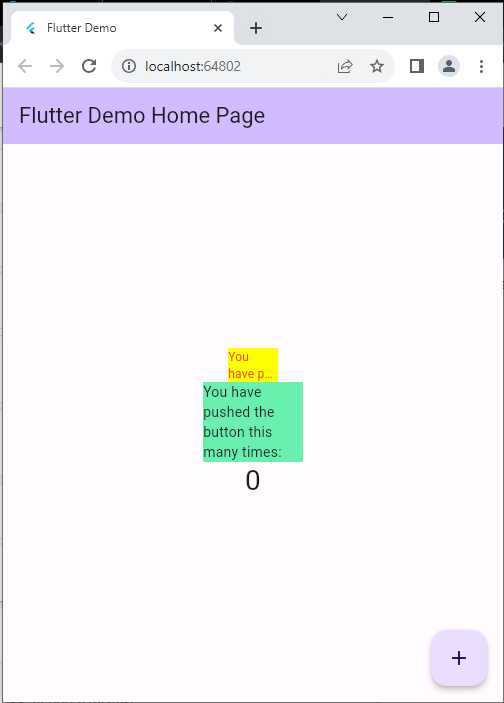

## Nama Septi Lutfiana
## NIM 2141720038
## Kelas 3H D-IV TI

## kode red_text_widget.dart
```dart
import 'package:auto_size_text/auto_size_text.dart';
import 'package:flutter/material.dart';

class RedTextWidget extends StatelessWidget {
  final String text;
  const RedTextWidget({Key? key, required this.text}) : super(key: key);

  @override
  Widget build(BuildContext context) {
    return AutoSizeText(
      text,
      style: const TextStyle(color: Colors.red, fontSize: 14),
      maxLines: 2,
      overflow: TextOverflow.ellipsis,
    );
  }
}

```

## Kode main.dart

```dart
import 'package:flutter/material.dart';
import 'package:flutter_plugin_pubdev/red_text_widget.dart';

void main() {
  runApp(const MyApp());
}

class MyApp extends StatelessWidget {
  const MyApp({super.key});

  // This widget is the root of your application.
  @override
  Widget build(BuildContext context) {
    return MaterialApp(
      title: 'Flutter Demo',
      debugShowCheckedModeBanner: false,
      theme: ThemeData(
        colorScheme: ColorScheme.fromSeed(seedColor: Colors.deepPurple),
        useMaterial3: true,
      ),
      home: const MyHomePage(title: 'Flutter Demo Home Page'),
    );
  }
}

class MyHomePage extends StatefulWidget {
  const MyHomePage({super.key, required this.title});

  final String title;

  @override
  State<MyHomePage> createState() => _MyHomePageState();
}

class _MyHomePageState extends State<MyHomePage> {
  int _counter = 0;

  void _incrementCounter() {
    setState(() {
      _counter++;
    });
  }

  @override
  Widget build(BuildContext context) {
    return Scaffold(
      appBar: AppBar(
        backgroundColor: Theme.of(context).colorScheme.inversePrimary,
        title: Text(widget.title),
      ),
      body: Center(
        child: Column(
          mainAxisAlignment: MainAxisAlignment.center,
          children: <Widget>[
            Container(
              color: Colors.yellowAccent,
              width: 50,
              child: const RedTextWidget(
                text: 'You have pushed the button this many times:',
              ),
            ),
            Container(
              color: Colors.greenAccent,
              width: 100,
              child: const Text(
                'You have pushed the button this many times:',
              ),
            ),
            Text(
              '$_counter',
              style: Theme.of(context).textTheme.headlineMedium,
            ),
          ],
        ),
      ),
      floatingActionButton: FloatingActionButton(
        onPressed: _incrementCounter,
        tooltip: 'Increment',
        child: const Icon(Icons.add),
      ), // This trailing comma makes auto-formatting nicer for build methods.
    );
  }
}

```

### Tugas Praktikum
1. Selesaikan Praktikum tersebut, lalu dokumentasikan dan push ke repository Anda berupa screenshot hasil pekerjaan beserta penjelasannya di file README.md!

2. Jelaskan maksud dari langkah 2 pada praktikum tersebut!

Tambahkan plugin auto_size_text menggunakan perintah berikut di terminal

```dart
flutter pub add auto_size_text
```

### penjelasan

widget AutoSizeText yang secara otomatis menyesuaikan ukuran teksnya untuk cocok dengan batas yang ditetapkan

3. Jelaskan maksud dari langkah 5 pada praktikum tersebut!

### penjelasan
final String text;: Ini adalah deklarasi variabel yang bertipe String dan ditandai dengan kata kunci final, yang berarti nilainya tidak dapat diubah setelah diberi nilai. Variabel text ini akan digunakan untuk menampilkan teks pada widget RedTextWidget
membuat widget RedTextWidget yang memiliki parameter text sebagai input wajib, yang kemudian dapat digunakan untuk menampilkan teks dengan warna merah (dalam hal ini, dengan warna teks merah). Widget ini nantinya dapat digunakan di dalam kode Flutter untuk menampilkan teks yang diberikan dengan warna merah.


4. Pada langkah 6 terdapat dua widget yang ditambahkan, jelaskan fungsi dan perbedaannya!

### penjelasan
Container: Widget yang digunakan untuk mengatur tata letak dan dekorasi bagi widget di dalamnya.

color: Colors.yellowAccent: Mengatur warna latar belakang Container menjadi kuning kekuningan.

width: 50: Mengatur lebar Container sebesar 50 piksel.

child: const RedTextWidget(text: 'You have pushed the button this many times:'): Menjadikan RedTextWidget (diasumsikan telah didefinisikan sebelumnya) sebagai child (anak) dari Container ini. RedTextWidget akan menampilkan teks yang diberikan (dalam hal ini adalah 'You have pushed the button this many times:') dengan warna merah, berdasarkan definisi dari widget RedTextWidget.
 
kode kedua

Container: Widget yang sama seperti sebelumnya, digunakan untuk mengatur tata letak dan dekorasi bagi widget di dalamnya.

color: Colors.greenAccent: Mengatur warna latar belakang Container menjadi hijau kehijauan.

width: 100: Mengatur lebar Container sebesar 100 piksel.

child: const Text('You have pushed the button this many times:'): Menjadikan Text sebagai child dari Container ini. Text ini akan menampilkan teks yang diberikan ('You have pushed the button this many times:') dengan gaya teks bawaan (hitam dengan ukuran teks tertentu) tanpa perubahan warna atau gaya lainnya.

### perbedaan

Jadi, perbedaannya terletak pada kustomisasi dan kemampuan untuk mengontrol penampilan teks. RedTextWidget dirancang khusus untuk menampilkan teks dengan warna merah (sesuai dengan namanya), sementara Text merupakan widget bawaan yang akan menampilkan teks dengan gaya default Flutter kecuali jika ada penyesuaian gaya tambahan yang diberikan kepadanya.


5. Jelaskan maksud dari tiap parameter yang ada di dalam plugin auto_size_text berdasarkan tautan pada dokumentasi ini !

- key*	Mengontrol bagaimana satu widget menggantikan widget lain di pohon.

- textKey	Menetapkan kunci untuk Textwidget yang dihasilkan
-style*	Jika bukan null, gaya yang digunakan untuk teks ini
- minFontSize	Batasan ukuran teks minimum yang akan digunakan saat mengubah ukuran teks secara otomatis. Diabaikan jika presetFontSizesdisetel.
- maxFontSize	Batasan ukuran teks maksimum yang akan digunakan saat mengubah ukuran teks secara otomatis.Diabaikan jika presetFontSizesdisetel.
- stepGranularity	Ukuran langkah di mana ukuran font disesuaikan dengan batasan.
- presetFontSizes	Mendefinisikan sebelumnya semua kemungkinan ukuran font. Penting: presetFontSizes harus dalam urutan menurun.
- group	Menyinkronkan ukuran beberapa AutoSizeTexts
- textAlign*	Bagaimana teks harus disejajarkan secara horizontal.
- textDirection*	Arah teks. Ini menentukan bagaimana textAlignnilai-nilai disukai - TextAlign.startdan TextAlign.endditafsirkan.
- locale*	Digunakan untuk memilih font ketika karakter Unicode yang sama dapat dirender secara berbeda, bergantung pada lokalnya.
- softWrap*	Apakah teks harus terputus pada jeda baris yang lembut.
- wrapWords	Apakah kata-kata yang tidak muat dalam satu baris harus dibungkus.
- Defaultnya adalah trueberperilaku seperti Text.
- overflow*	Bagaimana visual overflow harus ditangani.
- overflowReplacement	Jika teks meluap dan tidak sesuai batasnya, widget ini akan ditampilkan.
- textScaleFactor*	Jumlah piksel font untuk setiap piksel logis. Juga mempengaruhi 
- minFontSize, maxFontSizedan presetFontSizes.
- maxLines	Jumlah baris maksimum opsional untuk merentangkan teks.
- semanticsLabel*	Label semantik alternatif untuk teks ini.

6.  Hasil
