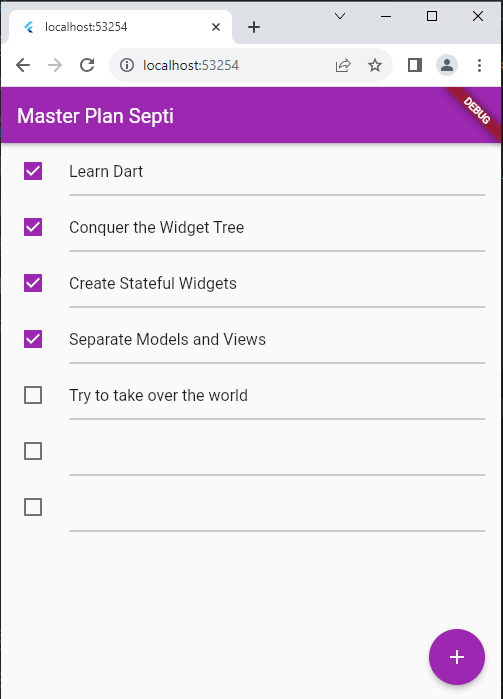

# master_plan

- Nama Septi Lutfiana
- NIM 2141720038
- KELAS 3H TI

# Praktikum 1: Dasar State dengan Model-View

### task.dart
```dart
class Task {
  final String description;
  final bool complete;
  
  const Task({
    this.complete = false,
    this.description = '',
  });
}
```

### data_layer.dart
```dart
export 'plan.dart';
export 'task.dart';
```

### plan.dart
```dart
import './task.dart';

class Plan {
  final String name;
  final List<Task> tasks;
  
  const Plan({this.name = '', this.tasks = const []});
}
```
### plan_screen.dart
```dart
import '../models/data_layer.dart';
import 'package:flutter/material.dart';

class PlanScreen extends StatefulWidget {
  const PlanScreen({super.key});

  @override
  State createState() => _PlanScreenState();
}

class _PlanScreenState extends State<PlanScreen> {
  late ScrollController scrollController;
  Plan plan = const Plan();

  @override
  void initState() {
    super.initState();
    scrollController = ScrollController()
      ..addListener(() {
        FocusScope.of(context).requestFocus(FocusNode());
      });
  }

  @override
  Widget build(BuildContext context) {
    return Scaffold(
      // ganti ‘Namaku' dengan Nama panggilan Anda
      appBar: AppBar(title: const Text('Master Plan Septi')),
      body: _buildList(),
      floatingActionButton: _buildAddTaskButton(),
    );
  }

  Widget _buildAddTaskButton() {
    return FloatingActionButton(
      child: const Icon(Icons.add),
      onPressed: () {
        setState(() {
          plan = Plan(
            name: plan.name,
            tasks: List<Task>.from(plan.tasks)..add(const Task()),
          );
        });
      },
    );
  }

  Widget _buildList() {
    return ListView.builder(
      controller: scrollController,
      keyboardDismissBehavior: Theme.of(context).platform == TargetPlatform.iOS
          ? ScrollViewKeyboardDismissBehavior.onDrag
          : ScrollViewKeyboardDismissBehavior.manual,
      itemCount: plan.tasks.length,
      itemBuilder: (context, index) => _buildTaskTile(plan.tasks[index], index),
    );
  }

  Widget _buildTaskTile(Task task, int index) {
    return ListTile(
      leading: Checkbox(
          value: task.complete,
          onChanged: (selected) {
            setState(() {
              plan = Plan(
                name: plan.name,
                tasks: List<Task>.from(plan.tasks)
                  ..[index] = Task(
                    description: task.description,
                    complete: selected ?? false,
                  ),
              );
            });
          }),
      title: TextFormField(
        initialValue: task.description,
        onChanged: (text) {
          setState(() {
            plan = Plan(
              name: plan.name,
              tasks: List<Task>.from(plan.tasks)
                ..[index] = Task(
                  description: text,
                  complete: task.complete,
                ),
            );
          });
        },
      ),
    );
  }

  @override
  void dispose() {
    scrollController.dispose();
    super.dispose();
  }
}

```

### Hasil Langkah 1-9




### soal
2. Jelaskan maksud dari langkah 4 pada praktikum tersebut! Mengapa dilakukan demikian?

- export 'plan.dart';: Ini mengekspor semua definisi yang ada dalam file 'plan.dart'. Ketika menggunakan file ini di file Dart lainnya, dapat mengakses kelas, fungsi, atau variabel yang didefinisikan di 'plan.dart'.

- export 'task.dart';: Sama seperti sebelumnya, ini mengekspor semua definisi yang ada dalam file 'task.dart'. Dengan demikian, dapat menggunakan kelas, fungsi, atau variabel yang didefinisikan di 'task.dart' saat mengimpor file ini di tempat lain.

# Praktikum 2