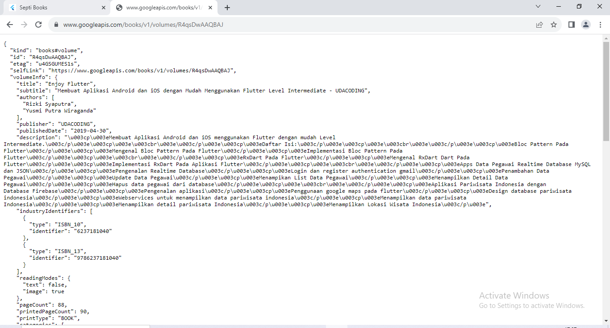
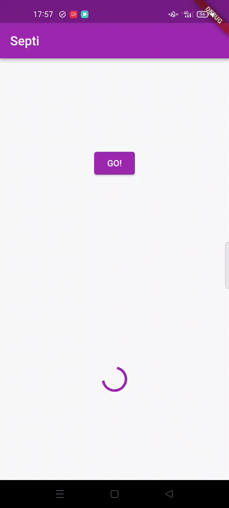
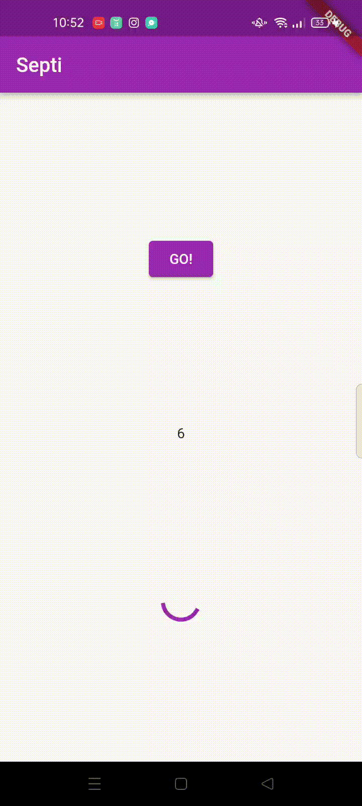
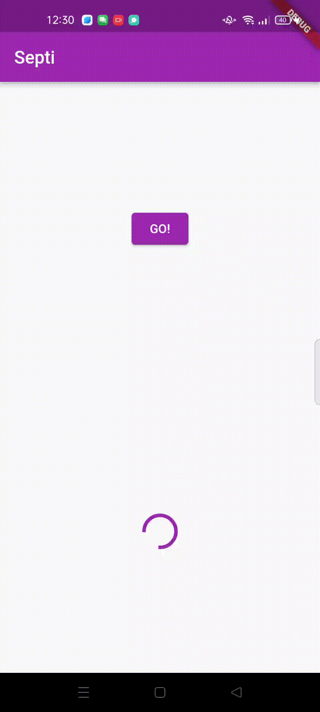
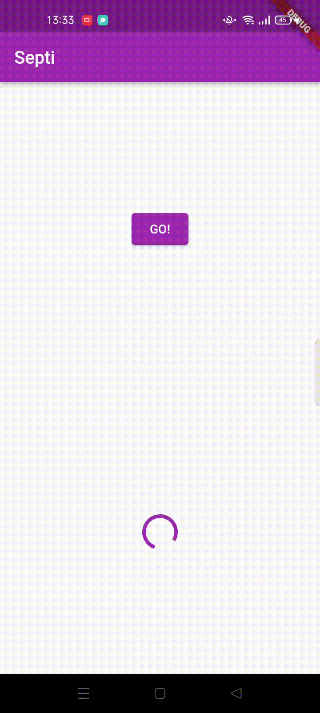
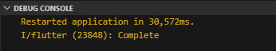
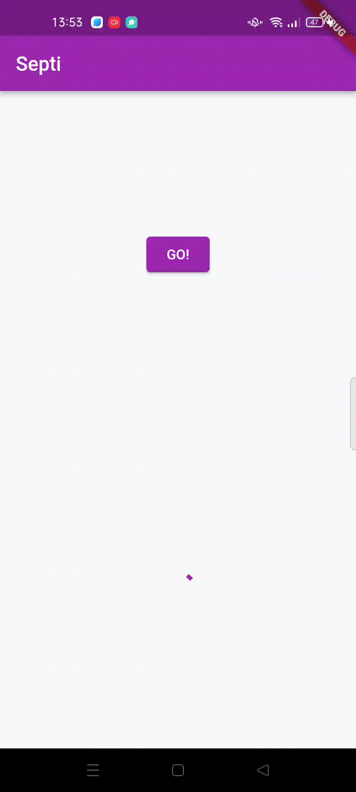
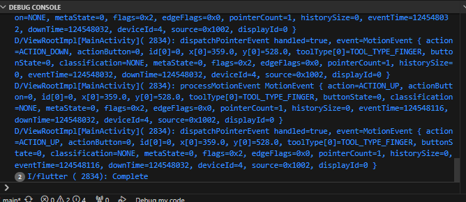
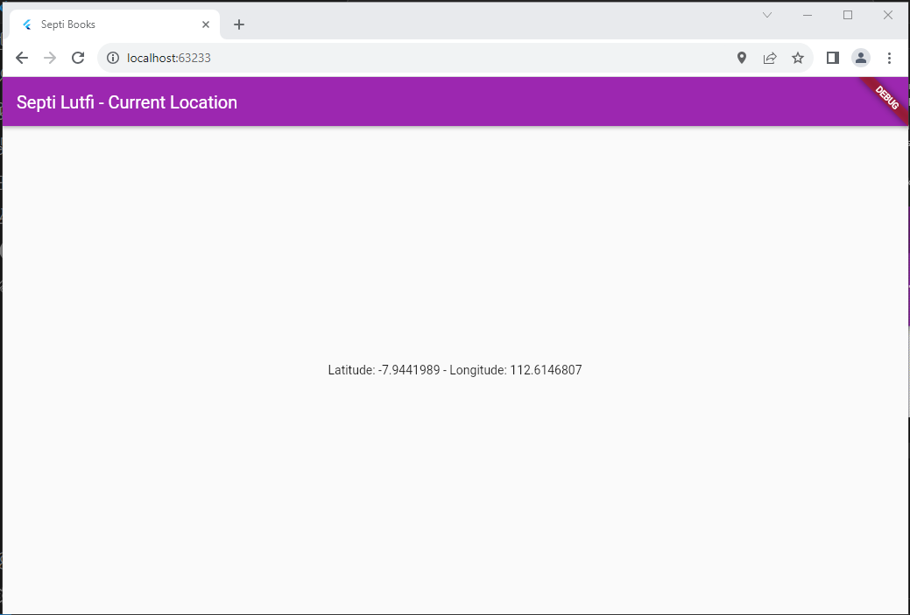
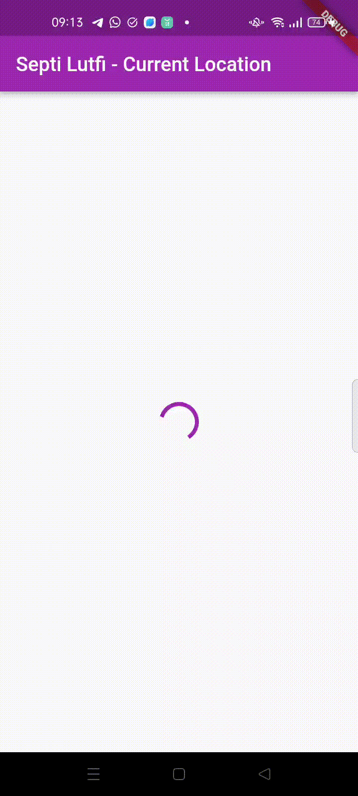

- Nama Septi Lutfiana
- NIM 2141720038
- Kelas 3H TI

## Praktikum 1: Mengunduh Data dari Web Service (API)

### Soal 1

Tambahkan nama panggilan Anda pada title app sebagai identitas hasil pekerjaan Anda

```dart
import 'dart:async';
import 'package:flutter/material.dart';
import 'package:http/http.dart';
import 'package:http/http.dart' as http;

void main() {
  runApp(const MyApp());
}

class MyApp extends StatelessWidget {
  const MyApp({super.key});

  // This widget is the root of your application.
  @override
  Widget build(BuildContext context) {
    return MaterialApp(
      title: 'Flutter Demo',
      theme: ThemeData(
        primarySwatch: Colors.blue,
        visualDensity: VisualDensity.adaptivePlatformDensity,
      ),
      home: const FuturePage(),
    );
  }
}

class FuturePage extends StatefulWidget {
  const FuturePage({super.key});

  @override
  State<FuturePage> createState() => _FuturePageState();
}

class _FuturePageState extends State<FuturePage> {
  String result = '';

  @override
  Widget build(BuildContext context) {
    return Scaffold(
      appBar: AppBar(
        title: const Text("Septi"),
      ),
      body: Center(
        child: Column(
          children: [
            const Spacer(),
            ElevatedButton(
              child: const Text('GO!'),
              onPressed: () {},
            ),
            const Spacer(),
            Text(result),
            const Spacer(),
            const CircularProgressIndicator(),
            const Spacer(),
          ],
        ),
      ),
    );
  }
}
```
### Soal 2

- Carilah judul buku favorit Anda di Google Books, lalu ganti ID buku pada variabel path di kode tersebut. Caranya ambil di URL browser Anda seperti gambar berikut ini.

```dart
 Future<Response> getData() async {
    const authority = 'www.googleapis.com';
    const path = '/books/v1/volumes/nzK4ImIeEV4C';
    Uri url = Uri.https(authority, path);
    return http.get(url);
  }
```


- Kemudian cobalah akses di browser URI tersebut dengan lengkap seperti ini. Jika menampilkan data JSON, maka Anda telah berhasil. Lakukan capture milik Anda dan tulis di README pada laporan praktikum. Lalu lakukan commit dengan pesan "W12: Soal 2".



### Soal 3

```dart
ElevatedButton(
              child: const Text('GO!'),
              onPressed: () {
                setState(() {});
                getData().then((value) {
                  result = value.body.toString().substring(0, 450);
                  setState(() {});
                }).catchError((_) {
                  result = 'An error occurred';
                  setState(() {});
                });
              },
            ),
```

- Jelaskan maksud kode langkah 5 tersebut terkait substring dan catchError!

Substring merujuk pada serangkaian karakter yang diambil dari string yang lebih besar. substring dapat melibatkan dua parameter, yaitu indeks awal dan panjang substring yang diinginkan

catchError dapat digunakan untuk menangani kesalahan (error) yang mungkin terjadi selama eksekusi.

- Capture hasil praktikum Anda berupa GIF dan lampirkan di README. Lalu lakukan commit dengan pesan "W12: Soal 3"



## Praktikum 2: Menggunakan await/async untuk menghindari callbacks

```dart
Future<int> returnOneAsync() async {
    await Future.delayed(const Duration(seconds: 3));
    return 1;
  }

  Future<int> returnTwoAsync() async {
    await Future.delayed(const Duration(seconds: 3));
    return 2;
  }

  Future<int> returnThreeAsync() async {
    await Future.delayed(const Duration(seconds: 3));
    return 3;
  }

  Future count() async {
    int total = 0;
    total = await returnOneAsync();
    total += await returnTwoAsync();
    total += await returnThreeAsync();
    setState(() {
      result = total.toString();
    });
  }
```

```dart
ElevatedButton(
              child: const Text('GO!'),
              onPressed: () {
                count();
              }
)
```

### soal 4
- Jelaskan maksud kode langkah 1 dan 2 tersebut!

returnOneAsync: Ini adalah sebuah fungsi asynchronous yang menggunakan await untuk menunda eksekusi selama 3 detik menggunakan Future.delayed. Setelah menunggu selama 3 detik, fungsi ini mengembalikan nilai 1.

returnTwoAsync: Serupa dengan returnOneAsync, ini adalah fungsi asynchronous lainnya yang menunda eksekusi selama 3 detik dan kemudian mengembalikan nilai 2.

returnThreeAsync: Seperti dua fungsi sebelumnya, ini adalah fungsi asynchronous yang menunda eksekusi selama 3 detik dan mengembalikan nilai 3.

fungsi count ini menggabungkan hasil dari tiga operasi asynchronous dan mengupdate state dalam konteks Flutter setelah perhitungan selesai

- Capture hasil praktikum Anda berupa GIF dan lampirkan di README. Lalu lakukan commit dengan pesan "W12: Soal 4".



## Praktikum 3: Menggunakan Completer di Future
```dart
late Completer completer;

  Future getNumber() {
    completer = Completer<int>();
    calculate();
    return completer.future;
  }

  Future calculate() async {
    await Future.delayed(const Duration(seconds: 5));
    completer.complete(42);
  }
```

```dart
 getNumber().then((value) {
                  setState(() {
                    result = value.toString();
                  });
                });
```
### Soal 5
- Jelaskan maksud kode langkah 2 tersebut!

Fungsi getNumber membuat Completer, memanggil calculate untuk menghitung nilai, dan mengembalikan future yang akan menyelesaikan dengan nilai tersebut setelah perhitungan selesai. 

- Capture hasil praktikum Anda berupa GIF dan lampirkan di README. Lalu lakukan commit dengan pesan "W12: Soal 5".


#### langkah 5

```dart
 Future calculate() async {
    try {
      await new Future.delayed(const Duration(seconds: 5));
      completer.complete(42);
    } catch (_) {
      completer.completeError({});
    }
  }
```

#### langkah 6

```dart
onPressed: () {
                getNumber().then((value) {
                  setState(() {
                    result = value.toString();
                  });
                }).catchError((e) {
                  result = 'An error occurred';
                });
}
```
### Soal 6
- Jelaskan maksud perbedaan kode langkah 2 dengan langkah 5-6 tersebut!

langkah 5

 kode ini mencoba menangani exception yang mungkin terjadi selama proses perhitungan. Jika tidak ada exception, nilai 42 akan dianggap sebagai hasil perhitungan yang sukses. Jika ada exception, completer akan diselesaikan dengan error

Langkah 6

 kode ini mengimplementasikan suatu tindakan yang akan diambil ketika tombol ditekan. Jika operasi asynchronous (getNumber()) berhasil, nilai yang diterima akan ditampilkan di UI. Jika terjadi error selama operasi tersebut, pesan kesalahan akan ditampilkan

- Capture hasil praktikum Anda berupa GIF dan lampirkan di README. Lalu lakukan commit dengan pesan "W12: Soal 6".


## Praktikum 4: Memanggil Future secara paralel
#### langkah 1
```dart
void returnFG() {
    FutureGroup<int> futureGroup = FutureGroup<int>();
    futureGroup.add(returnOneAsync());
    futureGroup.add(returnTwoAsync());
    futureGroup.add(returnThreeAsync());
    futureGroup.close();
    futureGroup.future.then((List<int> value) {
      int total = 0;
      for (var element in value) {
        total += element;
      }
      setState(() {
        result = total.toString();
      });
    });
  }
```
#### langkah 2
```dart
onPressed: () {
                returnFG();
}
```
### Soal 7

- Capture hasil praktikum Anda berupa GIF dan lampirkan di README. Lalu lakukan commit dengan pesan "W12: Soal 7


#### langkah 4
```dart
 void returnFG() {
    final futures = Future.wait<int>([
      returnOneAsync(),
      returnTwoAsync(),
      returnThreeAsync(),
    ]);
 }
```

### soal 8

Jelaskan maksud perbedaan kode langkah 1 dan 4!

- langkah 1
kode ini menggunakan FutureGroup untuk mengelola dan menunggu beberapa Future, dan setelah semuanya selesai, hasilnya dijumlahkan dan ditampilkan dalam UI.

- langkah 4
fungsi returnFG menggunakan Future.wait untuk menangani dan menunggu hingga ketiga fungsi asynchronous selesai. 

## Praktikum 5: Menangani Respon Error pada Async Code

#### langkah 1
```dart
Future returnError() async {
    await Future.delayed(const Duration(seconds: 2));
    throw Exception('Something Terrible Happened');
  }
```
#### langkah 2
```dart
onPressed: () {
                returnError().then((value) {
                  setState(() {
                    result = 'Succes';
                  });
                }).catchError((onError) {
                  setState(() {
                    result = onError.toString();
                  });
                }).whenComplete(() => print('Complete'));
}
```
### Soal 9
- Capture hasil praktikum Anda berupa GIF dan lampirkan di README. Lalu lakukan commit dengan pesan "W12: Soal 9".



#### Langkah 4
```dart

  Future handleError() async {
    try {
      await returnError();
    } catch (error) {
      setState(() {
        result = error.toString();
      });
    } finally {
      print('Complete');
    }
  }
```
### Soal 10
- Panggil method handleError() tersebut di ElevatedButton, lalu run. Apa hasilnya? Jelaskan perbedaan kode langkah 1 dan 4!

```dart
onPressed: () {
                handleError().then((value) {
                  setState(() {
                    result = 'Succes';
                  });
                }).catchError((onError) {
                  setState(() {
                    result = onError.toString();
                  });
                }).whenComplete(() => print('Complete'));
}
```



- perbedaan kode langkah 1 dan 4
 kode langkah 1 fungsi returnError() ini, adalah untuk menunggu selama 2 detik dan kemudian melempar suatu exception. Ini adalah pola umum yang digunakan dalam pemrograman asynchronous untuk menangani situasi yang dapat menghasilkan kesalahan atau kegagalan selama eksekusi operasi asynchronous. Pemanggil fungsi ini kemudian dapat menggunakan try-catch untuk menangkap dan menangani exception tersebut jika diperlukan. sedangkan kode langkah 4 menangani hasil dan kesalahan dari eksekusi handleError. Jika eksekusi berakhir tanpa kesalahan, maka variabel result diatur sebagai 'Success'. Jika terjadi kesalahan, variabel result diatur sebagai pesan kesalahan, dan pesan 'Complete' akan dicetak ke konsol.

## Praktikum 6: Menggunakan Future dengan StatefulWidget
## Soal 11
Tambahkan nama panggilan Anda pada tiap properti title sebagai identitas pekerjaan Anda.

```dart
Widget build(BuildContext context) {
    return Scaffold(
      appBar: AppBar(title: const Text('Septi Lutfi - Current Location')),
      body: Center(child: Text(myPosition)),
    );
  }

```
#### langkah 6
```dart
      home: LocationScreen(),
```
#### langkah 7-run


### soal 12

- Jika Anda tidak melihat animasi loading tampil, kemungkinan itu berjalan sangat cepat. Tambahkan delay pada method getPosition() dengan kode await Future.delayed(const Duration(seconds: 3));

- Apakah Anda mendapatkan koordinat GPS ketika run di browser? Mengapa demikian?  
iya mendapatkan koordinat GPS, hal ini dikarenakan sudah dilakukan deklrasi fungsi getPosition(), sehingga dapat mendapatkan koordinat  GPS



- Capture hasil praktikum Anda berupa GIF dan lampirkan di README. Lalu lakukan commit dengan pesan "W12: Soal 12".


## Praktikum 7: Manajemen Future dengan FutureBuilder
### Soal 13
- Apakah ada perbedaan UI dengan praktikum sebelumnya? Mengapa demikian?
   tidak, hal ini karena sama-sama menampilkan informasi lokasi geografis saat ini dengan menggunakan FutureBuilder untuk mengelola proses asynchronous untuk mendapatkan lokasi.

- Capture hasil praktikum Anda berupa GIF dan lampirkan di README. Lalu lakukan commit dengan pesan "W12: Soal 13".


- Seperti yang Anda lihat, menggunakan FutureBuilder lebih efisien, clean, dan reactive dengan Future bersama UI.

### Soal 14
- Apakah ada perbedaan UI dengan langkah sebelumnya? Mengapa demikian?
tidak, tidak ada perubahan karena disini hanya menambahkan kondisi jika eror akan muncul warning. untuk prosess loaading tetap sama hasilnya.
- Capture hasil praktikum Anda berupa GIF dan lampirkan di README. Lalu -lakukan commit dengan pesan "W12: Soal 14".


## Praktikum 8: Navigation route dengan Future Function
### Soal 15
- Tambahkan nama panggilan Anda pada tiap properti title sebagai identitas pekerjaan Anda.
- Silakan ganti dengan warna tema favorit Anda.
```dart
return Scaffold(
      backgroundColor: color,
      appBar: AppBar( title: const Text("Septi-Navigation First Screen"),
      ),
      body: Center(child: ElevatedButton(child: const Text('Change Color'),
      onPressed: () {
        _navigateAndGetColor(context);
      }),
      ),
    );
```

### Soal 16

- Cobalah klik setiap button, apa yang terjadi ? Mengapa demikian ?

Saat kita mengklik button maka akan berganti warna sesuai button yang di klik, jika butten red (tampilan akan berwarna merah), jika button blue (tampilan akan berwarna blue), jika button green (tampilan akan berwarna green). Hal ini terjadi karena kita menerapkan fungsi Navigator.pop.
- Gantilah 3 warna pada langkah 5 dengan warna favorit Anda!
- Capture hasil praktikum Anda berupa GIF dan lampirkan di README. Lalu lakukan commit dengan pesan "W12: Soal 16"


## Praktikum 9: Memanfaatkan async/await dengan Widget Dialog
### Soal 17
- Cobalah klik setiap button, apa yang terjadi ? Mengapa demikian ?

Saat kita mengklik button maka akan berganti warna sesuai button yang di klik, jika butten red (tampilan akan berwarna merah), jika button blue (tampilan akan berwarna blue), jika button green (tampilan akan berwarna green). Hal ini terjadi karena kita menerapkan fungsi  _showColorDialog() untuk menampikan pesan dialog pilihan warna.

- Gantilah 3 warna pada langkah 3 dengan warna favorit Anda!
- Capture hasil praktikum Anda berupa GIF dan lampirkan di README. Lalu lakukan commit dengan pesan "W12: Soal 17".
