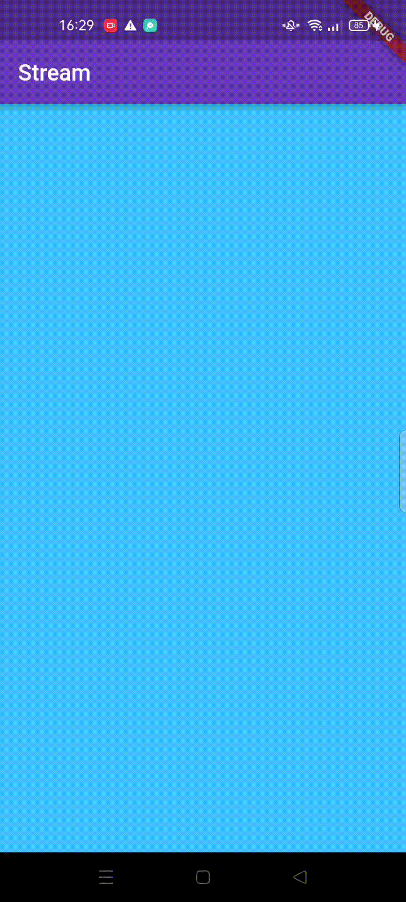
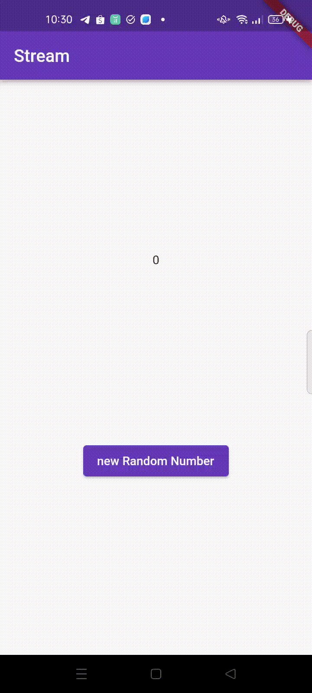
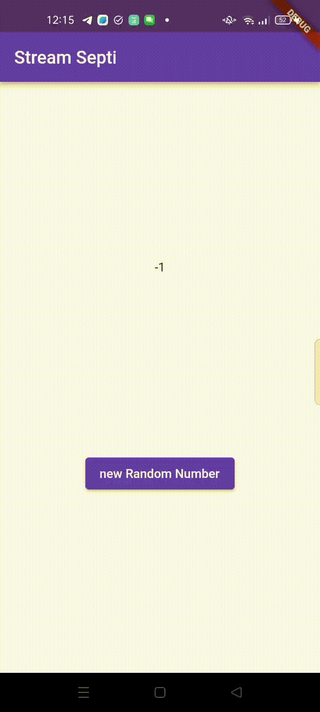
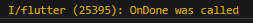
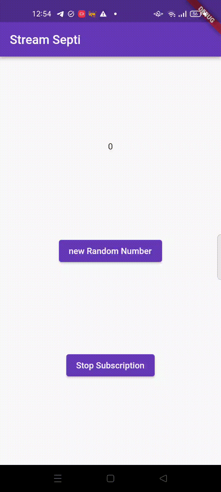
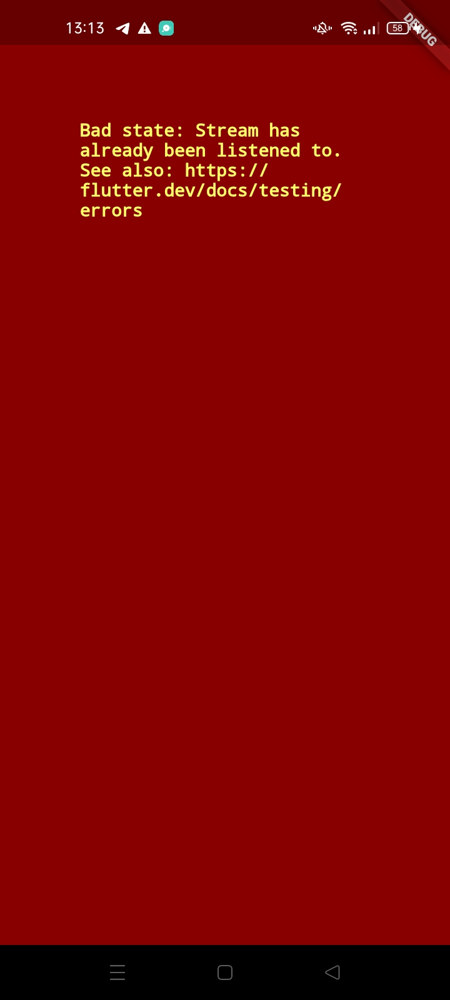
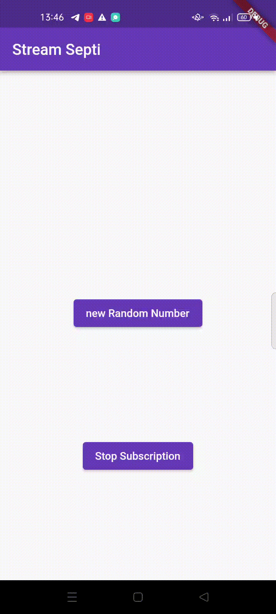
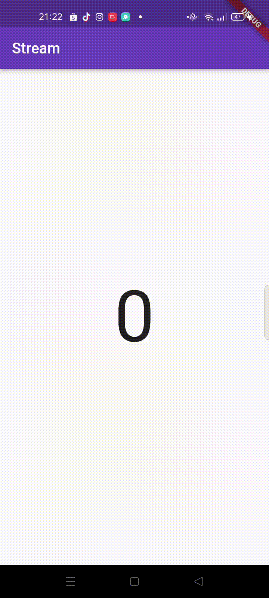

- Nama Septi Lutfiana
- NIM 2141720038
- Kelas 3H TI

## Praktikum 1: Dart Streams
### Soal 1
- Tambahkan nama panggilan Anda pada title app sebagai identitas hasil pekerjaan Anda.
```dart
 @override
  Widget build(BuildContext context) {
    return MaterialApp(
      title: 'Stream Septi',
      theme: ThemeData(
        primarySwatch: Colors.deepPurple,
      ),
      home: const StreamHomePage(),
    );
  }
```
- Gantilah warna tema aplikasi sesuai kesukaan Anda.
```dart
 @override
  Widget build(BuildContext context) {
    return MaterialApp(
      title: 'Stream Septi',
      theme: ThemeData(
        primarySwatch: Colors.deepPurple,
      ),
      home: const StreamHomePage(),
    );
  }
```
- Lakukan commit hasil jawaban Soal 1 dengan pesan "W13: Jawaban Soal 1"

### Soal 2
- Tambahkan 5 warna lainnya sesuai keinginan Anda pada variabel colors tersebut.

```dart
import 'package:flutter/material.dart';

class ColorStream {
  final List<Color> colors = [
    Colors.blueGrey,
    Colors.amber,
    Colors.deepPurple,
    Colors.lightBlue,
    Colors.teal,
    Colors.pink,
    Colors.pinkAccent,
    Colors.orangeAccent,
    Colors.greenAccent,
    Colors.lightBlueAccent
  ];
}

```
- Lakukan commit hasil jawaban Soal 2 dengan pesan "W13: Jawaban Soal 2"

### Soal 3
- Jelaskan fungsi keyword yield* pada kode tersebut!

Keyword yield* digunakan untuk menggabungkan atau "melempar" elemen dari satu stream ke dalam stream lain.

- Apa maksud isi perintah kode tersebut?

sebuah stream yang mengeluarkan elemen-elemen warna secara periodik setiap detik, dengan urutan yang diulang dari colors.

- Lakukan commit hasil jawaban Soal 3 dengan pesan "W13: Jawaban Soal 3"

### Soal 4
- Capture hasil praktikum Anda berupa GIF dan lampirkan di README.


- Lakukan commit hasil jawaban Soal 4 dengan pesan "W13: Jawaban Soal 4"

### Soal 5
- Jelaskan perbedaan menggunakan listen dan await for (langkah 9) !

Metode listen biasanya digunakan ketika kita ingin mengamati (observe) data yang masuk ke dalam stream secara terus-menerus tanpa memutuskan hubungan dengan stream. Sedangkan await for berguna ketika kita ingin memproses setiap data yang ada di dalam stream secara berurutan dan menunggu hingga semua data di stream telah diproses sebelum melanjutkan eksekusi kode selanjutnya

- Lakukan commit hasil jawaban Soal 5 dengan pesan "W13: Jawaban Soal 5"
### Soal 6
- Jelaskan maksud kode langkah 8 dan 10 tersebut!
Kode pada langkah 8 menginisialisasi objek NumberStream dan StreamController, dan kemudian mendengarkan perubahan data di dalam stream menggunakan metode listen. Setiap kali ada data baru yang masuk, nilai lastNumber diperbarui dan tampilan diperbarui menggunakan setState. Sedangkan pada langkah 10 fungsi addRandomNumber() yang berfungsi untuk menambahkan bilangan acak ke dalam stream
- Capture hasil praktikum Anda berupa GIF dan lampirkan di README.

- Lalu lakukan commit dengan pesan "W13: Jawaban Soal 6".

### Soal 7
- Jelaskan maksud kode langkah 13 sampai 15 tersebut!
```dart
addError() {
    controller.sink.addError('Eror');
  }
```


```dart
 stream.listen((event) {
      setState(() {
        lastNumber = event;
      });
    }).onError((error) {
      setState(() {
        lastNumber = -1;
      });
    });
```

```dart
numberStream.addError();
```
Dengan menggunakan metode onError, kita dapat menangani kesalahan yang terjadi dalam stream dengan melakukan tindakan yang sesuai. Dalam contoh tersebut, jika terjadi kesalahan, nilai lastNumber akan diubah menjadi -1 dan tampilan akan diperbarui melalui setState().


- Kembalikan kode seperti semula pada Langkah 15, comment addError() agar Anda dapat melanjutkan ke praktikum 3 berikutnya.

- Lalu lakukan commit dengan pesan "W13: Jawaban Soal 7"

## Praktikum 3: Injeksi data ke streams
### Soal 8
- Jelaskan maksud kode langkah 1-3 tersebut!
```dart
  late StreamTransformer transformer;
```
menunjukkan pembuatan variabel transformer yang merupakan objek dari kelas StreamTransformer. Kata kunci late menandakan bahwa nilai variabel ini akan diinisialisasi nanti, tetapi tidak perlu diinisialisasi saat deklarasi variabel.

```dart
transformer = StreamTransformer<int, int>.fromHandlers(
        handleData: (value, sink) {
          sink.add(value * 10);
        },
        handleError: (error, trace, sink) {
          sink.add(-1);
        },
        handleDone: (sink) => sink.close());
```
- handleData: (value, sink) { ... }: Memberikan callback untuk menangani data yang masuk ke dalam stream. Ketika data masuk, callback ini akan dipanggil dengan nilai data tersebut (value) dan objek sink (sink) yang digunakan untuk mengirim data ke dalam stream.

    (value, sink) adalah parameter yang diberikan ke callback. value adalah nilai data yang masuk ke dalam stream, sedangkan sink adalah objek sink yang digunakan untuk mengirim data ke dalam stream.
    
    Di dalam callback, sink.add(value * 10) digunakan untuk mengalikan nilai data dengan 10 dan mengirimkannya kembali ke dalam stream menggunakan sink.add().

- handleError: (error, trace, sink) { ... }: Memberikan callback untuk menangani kesalahan yang terjadi dalam stream. Ketika terjadi kesalahan, callback ini akan dipanggil dengan nilai kesalahan (error), stack trace (trace), dan objek sink (sink) yang digunakan untuk mengirim data ke dalam stream.

    (error, trace, sink) adalah parameter yang diberikan ke callback. error adalah nilai kesalahan yang terjadi, trace adalah stack trace yang menggambarkan jejak pemanggilan yang mengarah ke kesalahan, dan sink adalah objek sink yang digunakan untuk mengirim data ke dalam stream.
    
    Di dalam callback, sink.add(-1) digunakan untuk mengirimkan nilai -1 ke dalam stream menggunakan sink.add() sebagai tanda bahwa terjadi kesalahan.

- handleDone: (sink) => sink.close(): Memberikan callback yang dipanggil ketika stream telah selesai atau ditutup. Callback ini menerima objek sink (sink) yang digunakan untuk mengirim data ke dalam stream.

    (sink) adalah parameter yang diberikan ke callback. sink adalah objek sink yang digunakan untuk mengirim data ke dalam stream.
    
    Di dalam callback, sink.close() digunakan untuk menutup stream dan memberi tahu bahwa tidak akan ada data lebih lanjut yang akan dikirim.

```dart
stream.transform(transformer).listen((event) {
      setState(() {
        lastNumber = event;
      });
    }).onError((error) {
      setState(() {
        lastNumber = -1;
      });
    });
    super.initState();
```
Dengan menggunakan metode transform() pada stream dan mendaftarkan callback menggunakan listen(), serta menangani kesalahan menggunakan onError(), kita dapat melakukan manipulasi pada stream dan merespons data yang masuk atau kesalahan yang terjadi. 

- Capture hasil praktikum Anda berupa GIF dan lampirkan di README.


- Lalu lakukan commit dengan pesan "W13: Jawaban Soal 8".

## Praktikum 4: Subscribe ke stream events

### Soal 9
- Jelaskan maksud kode langkah 2, 6 dan 8 tersebut!
```dart 
 subscription = stream.listen((event) {
      setState(() {
        lastNumber = event;
      });
    });
```
metode `listen()` dipanggil pada objek `stream` untuk mendaftarkan _listener_ yang akan dipanggil setiap kali ada data baru yang tersedia di dalam stream. _Listener_ ini mengambil nilai data (`event`) yang masuk ke dalam stream dan memperbarui `lastNumber` dengan nilai tersebut melalui `setState()`. Dengan mendaftarkan _listener_ ini, kita dapat merespons data yang masuk ke dalam stream.

```dart
    subscription.cancel();
```
jika kita ingin menghentikan penerimaan data dari stream, kita dapat membatalkan _subscription_ dengan memanggil metode `cancel()` pada objek `subscription`. Ini akan menghentikan pemanggilan _listener_ pada stream.

```dart
void addRandomNumber() {
    Random random = Random();
    int myNum = random.nextInt(10);
    if (!numberStreamController.isClosed) {
      numberStream.addNumberToSink(myNum);
    } else {
      setState(() {
        lastNumber = -1;
      });
    }
}
```
menambahkan angka acak ke dalam stream dengan memeriksa keadaan stream. Jika stream telah ditutup, lastNumber diperbarui dengan -1

- Capture hasil praktikum Anda berupa GIF dan lampirkan di README.




- Lalu lakukan commit dengan pesan "W13: Jawaban Soal 9".

## Praktikum 5: Multiple stream subscriptions
- hasil run


### soal 10
- Jelaskan mengapa error itu bisa terjadi ?
hal ini terjadi karena terdapat deklarasi fungsi listen() sebanyak dua kali atau sebelumnya sudah terdapat fungsi listen(). Dan juga setiap stream hanya dapat memiliki satu listener aktif pada suatu waktu.

### Soal 11
- Jelaskan mengapa hal itu bisa terjadi ?
hal ini bisa terjadi karena menerapkan .asBroadcastStream(), hal ini karena dapat memungkinkan banyak listener pada stream secara independen.

- Capture hasil praktikum Anda berupa GIF dan lampirkan di README.

- Lalu lakukan commit dengan pesan "W13: Jawaban Soal 10,11".

## Praktikum 6: StreamBuilder
### Soal 12
- Jelaskan maksud kode pada langkah 3 dan 7 !
langkah 3

Fungsi tersebut menggunakan kelas Random untuk menghasilkan bilangan acak antara 0 dan 9 menggunakan metode nextInt(10). Kemudian, bilangan acak tersebut dikembalikan sebagai nilai stream menggunakan pernyataan return.

langkah 7

StreamBuilder digunakan untuk membangun UI berdasarkan data yang diterima dari numberStream

- Properti stream pada StreamBuilder diatur dengan numberStream, yang merupakan stream yang ingin Anda pantau perubahannya.

- Properti initialData diatur dengan nilai awal 0. Nilai ini akan digunakan ketika stream belum mengirimkan data.

- Properti builder berisi fungsi yang akan dipanggil setiap kali terdapat perubahan pada stream. Fungsi ini menerima dua parameter:
    context: Konteks dari widget.
    snapshot: Objek AsyncSnapshot yang berisi informasi tentang status stream dan data yang diterima.
- Di dalam fungsi builder, pertama-tama kita melakukan pengecekan terhadap snapshot.hasError. Jika terdapat error pada stream, maka pesan       "!Error" akan dicetak ke konsol.

- Selanjutnya, kita melakukan pengecekan terhadap snapshot.hasData. Jika terdapat data yang diterima dari stream, maka kita mengembalikan widget Center dengan child Text. Tekst tersebut akan menampilkan data yang diterima dari stream menggunakan snapshot.data.toString().

- Jika snapshot.hasData bernilai false, artinya belum ada data yang diterima dari stream, maka kita mengembalikan SizedBox.shrink(), yang merupakan widget kosong.


- Capture hasil praktikum Anda berupa GIF dan lampirkan di README.

- Lalu lakukan commit dengan pesan "W13: Jawaban Soal 12".

## Praktikum 7: BLoC Pattern
### Soal 13
- Jelaskan maksud praktikum ini ! Dimanakah letak konsep pola BLoC-nya ?
Praktikum ini memperkenalkan konsep BLoC (Business Logic Component) pada Flutter dengan menerapkan pola arsitektur BLoC. Konsep BLoC terletak pada kelas RandomNUmberBloc yang bertindak sebagai komponen logika bisnis. Dua StreamController digunakan untuk mengelola input dan output, yaitu _generateRandomController sebagai sink untuk menerima input dan _randomNumberController sebagai stream untuk mengirimkan output. Ketika tombol ditekan, generateRandom menerima input, dan melalui proses logika bisnis (pembuatan angka acak), hasilnya dikirimkan ke randomNumber untuk kemudian diteruskan ke antarmuka pengguna menggunakan StreamBuilder.
- Capture hasil praktikum Anda berupa GIF dan lampirkan di README.

- Lalu lakukan commit dengan pesan "W13: Jawaban Soal 13".